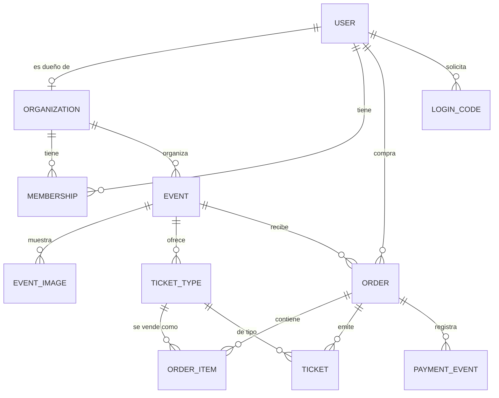

# Plan de construcción — Plataforma de venta de entradas con QR (MVP)

> **Documento de arquitectura y ejecución.** Describe, de principio a fin, cómo
> construir una plataforma simple de creación de eventos y venta de entradas con
> código QR: backend en Django, un design system propio y dos aplicaciones web
> en Next.js (una para organizadores, otra para compradores), con pasarela de
> pagos Izipay lista para activar con las llaves del comercio.
>
> **Principio rector:** *pocas piezas, bien hechas.* Todo lo que no sea
> indispensable para vender una entrada y validarla en la puerta queda fuera del
> MVP, pero el modelo de datos y la arquitectura se diseñan para que añadirlo
> después no requiera reescribir nada.

---

## Índice

1. [Resumen ejecutivo](#1-resumen-ejecutivo)
2. [Alcance del MVP](#2-alcance-del-mvp)
3. [Arquitectura general](#3-arquitectura-general)
4. [Modelo de datos](#4-modelo-de-datos)
5. [Backend Django](#5-backend-django)
6. [Contrato de API](#6-contrato-de-api)
7. [Flujos funcionales](#7-flujos-funcionales)
8. [Integración con Izipay](#8-integración-con-izipay)
9. [Design system "NOCTA"](#9-design-system-nocta)
10. [App del organizador (Next.js + PWA)](#10-app-del-organizador-nextjs--pwa)
11. [App del comprador (Next.js)](#11-app-del-comprador-nextjs)
12. [Roadmap de ejecución por fases](#12-roadmap-de-ejecución-por-fases)
13. [Seguridad y cumplimiento](#13-seguridad-y-cumplimiento)
14. [Infraestructura, despliegue y variables de entorno](#14-infraestructura-despliegue-y-variables-de-entorno)
15. [Calidad: testing y definición de "terminado"](#15-calidad-testing-y-definición-de-terminado)
16. [Fuera del MVP y ruta de escalado](#16-fuera-del-mvp-y-ruta-de-escalado)
17. [Anexos](#17-anexos)

---

## 1. Resumen ejecutivo

### 1.1 Qué se construye

Una plataforma de *ticketing* para eventos nocturnos y de música electrónica con
tres superficies:

| Superficie | Quién la usa | Qué resuelve |
|---|---|---|
| **API** (Django + DRF) | Ambas webs | Eventos, entradas, inventario, órdenes, pagos, emisión y validación de QR |
| **Panel del organizador** (Next.js PWA) | Productores / promotores | Crear y publicar eventos, subir imágenes, definir entradas y precios, ver ventas, escanear QR en puerta |
| **Tienda del comprador** (Next.js) | Público general | Ver el evento, armar carrito, registrarse con su email, pagar y recibir sus entradas con QR |

### 1.2 Las cinco decisiones que definen el sistema

1. **Una entrada vendida = una fila `Ticket` con código único y firmado.** El
   QR no lleva datos del comprador ni precios: solo un código opaco de 128 bits
   acompañado de una firma HMAC que el servidor verifica antes de tocar la base
   de datos. Un QR falsificado se rechaza sin consultar nada; uno repetido lo
   detecta la base. Toda la verdad vive en el servidor.
2. **El servidor siempre recalcula el dinero.** El cliente manda *qué* quiere
   comprar (tipo de entrada + cantidad), nunca *cuánto* cuesta. El total se
   recalcula desde la base de datos en cada paso.
3. **El pago se confirma por webhook (IPN), no por el navegador.** La respuesta
   del navegador sirve para dar feedback inmediato; la fuente de verdad es la
   notificación servidor-a-servidor firmada. Esto evita órdenes perdidas cuando
   el usuario cierra la pestaña y elimina la clase entera de fraudes de
   confirmación desde el cliente.
4. **El inventario se reserva con bloqueo a nivel de fila.** Nada de contar en
   memoria: `SELECT … FOR UPDATE` + restricción en base de datos hacen
   imposible el sobreventa aunque haya 500 personas comprando a la vez.
5. **Un solo design system, dos expresiones.** Los mismos tokens sirven al
   panel (denso, sobrio, funcional) y a la tienda (amplia, contrastada,
   con imagen protagonista). No hay dos lenguajes visuales que mantener.

### 1.3 Stack

| Capa | Tecnología | Por qué |
|---|---|---|
| Backend | **Python 3.12 · Django 5.x · Django REST Framework** | Admin gratuito, ORM maduro, migraciones fiables, ecosistema de pagos y storage resuelto |
| Base de datos | **PostgreSQL 16** | Transacciones serias, `SELECT FOR UPDATE`, JSONB para payloads de pasarela |
| Auth organizador | **JWT** (`djangorestframework-simplejwt`) | Sin sesión de servidor, fácil para dos SPAs |
| Auth comprador | **Código de un solo uso por email (OTP) + magic link** | Cero fricción, cero contraseñas que gestionar/filtrar |
| Archivos | **S3 compatible** (`django-storages` + `boto3`) | El disco de un PaaS es efímero: las imágenes deben vivir fuera del contenedor |
| Pagos | **Izipay** (formulario incrustado + IPN) | Requisito del negocio; aislado tras una interfaz `PaymentGateway` |
| Frontends | **Next.js 15+ (App Router) · TypeScript · Tailwind CSS v4 · Motion** | SSR para SEO del evento, un solo lenguaje para ambas apps, PWA nativa |
| PWA | **Serwist** (`@serwist/next`) | Service worker moderno y mantenido para Next.js App Router |
| Monorepo | **pnpm workspaces** | Tokens y cliente de API compartidos sin publicar paquetes |

### 1.4 Trazabilidad con la propuesta aprobada

Este documento es la **ejecución técnica** de la propuesta de arquitectura y
producto ya validada. Nada de lo comprometido allí se reinterpreta: se detalla.

| Compromiso de la propuesta | Dónde se resuelve aquí |
|---|---|
| Design system propio, referentes Linear / Vercel, dark de alto contraste | [§9](#9-design-system-nocta) — tokens, componentes y distribución |
| Paleta `#09090B` / `#121216`, superficies `#1A1A22`, bordes `#2E2E3A`, acentos Electric Violet `#7C3AED` y Neon Mint `#10B981` | [§9.2](#92-color) — valores exactos como tokens |
| Tipografía Inter / Plus Jakarta Sans | [§9.3](#93-tipografía) |
| Backend Django REST Framework modular | [§5](#5-backend-django) |
| Roles y accesos diferenciados Organizador / Cliente con JWT | [§5.4](#54-autenticación-y-permisos) |
| Gestión de eventos e inventario con control estricto de stock | [§4.2](#42-entidades) y [§5.5](#55-capa-de-servicios-el-corazón) |
| Motor de órdenes con tickets únicos **firmados** de alta seguridad | [§5.5](#55-capa-de-servicios-el-corazón) y [§5.6](#56-códigos-de-entrada-y-qr-firmado) |
| Pagos abstraídos, confirmación por **webhook**, listos a falta de llaves | [§8](#8-integración-con-izipay) |
| Portal del organizador PWA con wizard de 4 pasos y métricas en tiempo real | [§10](#10-app-del-organizador-nextjs--pwa) |
| Portal del cliente: evento → carrito → registro por email → pago | [§11](#11-app-del-comprador-nextjs) |
| Mi Cuenta: historial, tickets activos con QR y brillo optimizado, vencidos y validados | [§11.4](#114-mi-cuenta-el-centro-de-control-de-entradas) |
| Hitos 01–05 de la hoja de ruta | [§12](#12-roadmap-de-ejecución-por-fases) — cada fase mapeada a su hito |

**Precisión sobre "encriptación del identificador de ticket":** el objetivo
declarado —impedir duplicidad y falsificación— se cumple con **firma HMAC-SHA256
sobre un código aleatorio de 128 bits**, no con cifrado reversible. Cifrar el
identificador ocultaría su contenido (que no es secreto: es un código aleatorio)
pero no probaría su autenticidad; firmar sí, y además permite rechazar un QR
falso sin consultar la base de datos. Es la técnica correcta para este objetivo.

---

## 2. Alcance del MVP

### 2.1 Dentro

**Organizador**
- Inicio de sesión con email y contraseña.
- Crear evento: título, descripción, fecha/hora de inicio y fin, lugar
  (nombre, dirección, ciudad, enlace de mapa), edad mínima.
- Subir una o varias imágenes por evento; elegir cuál es la portada; reordenar.
- Crear tipos de entrada: nombre, descripción corta, precio, cantidad
  disponible, máximo por compra, ventana de venta opcional.
- Publicar / despublicar el evento y copiar su enlace público.
- Ver ventas: total recaudado, entradas vendidas por tipo, listado de órdenes.
- Escanear QR en la puerta desde el móvil (dentro de la misma PWA).

**Comprador**
- Ver la página pública del evento con imágenes, información y entradas.
- Armar un carrito con varios tipos de entrada y cantidades.
- Registrarse/identificarse con su email (código de un solo uso).
- Pagar con Izipay y recibir sus entradas por email y en su cuenta.
- Cuenta: entradas activas, entradas usadas, entradas vencidas, historial de
  compras, datos de perfil.

**Sistema**
- Emisión de un QR único por entrada al confirmarse el pago.
- Validación en puerta idempotente (la segunda lectura avisa "ya ingresó").
- Email transaccional: código de acceso y confirmación de compra con entradas.
- Documentación de API autogenerada (OpenAPI) y panel de administración Django.

### 2.2 Fuera (deliberadamente)

Personalización visual del landing por evento, temas, mapas de recinto y zonas,
lineup de artistas, promociones/combos, cupones y descuentos, dominios
personalizados, multi-organizador con equipos y permisos finos, comisiones
configurables por evento, ventas manuales/efectivo, entradas de cortesía,
reembolsos automáticos, transferencia de entradas entre personas, apps nativas,
analítica avanzada, multi-idioma, multi-moneda.

> Cada una de estas exclusiones tiene, en el modelo de datos, el punto de
> extensión señalado en §16 para que añadirla sea aditivo.

### 2.3 Criterios de éxito del MVP

1. Un organizador crea, ilustra y publica un evento en **menos de 5 minutos**
   desde el móvil, sin ayuda.
2. Un comprador pasa de la página del evento al QR en su pantalla en **menos de
   2 minutos** y **3 pantallas**.
3. Con 200 entradas a la venta y compras concurrentes, **jamás** se emiten 201.
4. En puerta, un escaneo resuelve en **menos de 1 segundo** con verde/rojo
   inequívoco.
5. Ningún importe cobrado depende de un valor enviado por el navegador.

---

## 3. Arquitectura general

### 3.1 Vista de componentes

```
                    ┌──────────────────────────────┐
                    │        Navegador móvil       │
                    └───────┬──────────────┬───────┘
                            │              │
              ┌─────────────▼───┐   ┌──────▼────────────────┐
              │  PANEL (PWA)    │   │  TIENDA               │
              │  Next.js        │   │  Next.js              │
              │  organizador    │   │  comprador            │
              │  + escáner QR   │   │  + carrito + checkout │
              └────────┬────────┘   └──────┬────────────────┘
                       │  JWT              │  JWT de comprador
                       │                   │
                       └────────┬──────────┘
                                │ HTTPS / JSON
                    ┌───────────▼────────────┐
                    │      API Django        │
                    │  DRF · servicios ·     │
                    │  dominio transaccional │
                    └──┬─────────┬────────┬──┘
                       │         │        │
            ┌──────────▼──┐  ┌───▼─────┐  │ IPN firmado
            │ PostgreSQL  │  │   S3    │  │  (webhook)
            │             │  │ imágenes│  │
            └─────────────┘  └─────────┘  │
                                   ┌──────▼──────┐
                                   │   Izipay    │
                                   └─────────────┘
                       │
            ┌──────────▼──────────┐
            │  Proveedor de email │  (Resend / SES / SMTP)
            └─────────────────────┘
```

### 3.2 Reglas de arquitectura (no negociables)

| # | Regla | Consecuencia práctica |
|---|---|---|
| A1 | **La lógica de negocio vive en `services/`, no en las vistas ni en los modelos** | Las vistas DRF validan entrada, llaman a un servicio y serializan la salida. Nada más. |
| A2 | **Toda operación con dinero o inventario es una transacción atómica con bloqueo explícito** | `transaction.atomic()` + `select_for_update()`. Sin excepciones. |
| A3 | **Los importes son `Decimal`, nunca `float`** | `DecimalField(max_digits=10, decimal_places=2)`. Los totales se suman en SQL (`Sum`) o con `Decimal`. |
| A4 | **El proveedor de pago se usa solo a través de una interfaz** | Se puede desarrollar y testear el flujo completo sin credenciales reales (`FakeGateway`). |
| A5 | **El estado de una orden solo avanza por transiciones válidas y explícitas** | Una función `transition(order, to_status)` que rechaza saltos inválidos. |
| A6 | **Nada que dependa de identidad se lee del cuerpo de la petición** | El organizador se deriva del JWT; el comprador, del JWT de comprador. |
| A7 | **Los endpoints públicos (catálogo, checkout, auth) van con límites de tasa** | `DRF throttling` por IP y por email. |
| A8 | **Los frontends nunca hablan con Izipay salvo para renderizar el formulario** | Los secretos viven únicamente en el backend. |

### 3.3 Estructura del repositorio

Un único repositorio, dos mundos (Python y Node) claramente separados:

```
ticketera/
├── backend/                       # Django
│   ├── config/                    # settings, urls, wsgi/asgi, celery (futuro)
│   │   ├── settings/
│   │   │   ├── base.py
│   │   │   ├── dev.py
│   │   │   └── prod.py
│   │   ├── urls.py
│   │   └── wsgi.py
│   ├── apps/
│   │   ├── accounts/              # usuarios, organizaciones, auth (org + comprador)
│   │   ├── events/                # eventos, imágenes, tipos de entrada
│   │   ├── orders/                # carrito → orden → tickets, inventario
│   │   ├── payments/              # interfaz de pasarela + Izipay + webhook
│   │   ├── checkin/               # validación de QR en puerta
│   │   └── common/                # base models, errores, paginación, utilidades
│   ├── tests/
│   ├── manage.py
│   ├── pyproject.toml
│   └── Dockerfile
│
├── apps/
│   ├── organizer/                 # Next.js — panel del organizador (PWA)
│   └── store/                     # Next.js — tienda del comprador
│
├── packages/
│   ├── tokens/                    # design system: CSS variables + preset Tailwind
│   ├── ui/                        # componentes React compartidos
│   └── api-client/                # tipos + fetcher generados desde OpenAPI
│
├── docker-compose.yml             # postgres + minio + backend para desarrollo
├── pnpm-workspace.yaml
└── README.md
```

**Por qué monorepo:** los tokens del design system y los tipos de la API se
comparten entre las dos webs sin publicar paquetes ni duplicar ficheros. El
backend es independiente y podría vivir aparte, pero tenerlo al lado hace que
`docker compose up` levante el sistema entero para un desarrollador nuevo.

### 3.4 Entornos

| Entorno | Base de datos | Pagos | Emails | Archivos |
|---|---|---|---|---|
| **Local** | Postgres en Docker | `FakeGateway` (aprueba/rechaza a voluntad) | consola | MinIO en Docker |
| **Staging** | Postgres gestionado | Izipay en modo pruebas | proveedor real, dominio de pruebas | bucket de staging |
| **Producción** | Postgres gestionado con backups | Izipay producción | proveedor real | bucket de producción + CDN |

---

## 4. Modelo de datos

### 4.1 Diagrama



### 4.2 Entidades

#### `accounts.User`
Un único modelo de usuario con rol. El comprador y el organizador son la misma
tabla porque *pueden ser la misma persona* (un promotor también compra entradas),
y porque duplicar la infraestructura de autenticación por dos audiencias es el
tipo de complejidad que este proyecto evita. La separación real ocurre en los
**permisos** y en el **scope del token**, no en el esquema.

| Campo | Tipo | Notas |
|---|---|---|
| `id` | UUID (PK) | UUID en todas las tablas: evita filtrar volumen de negocio en URLs |
| `email` | Email único | Identificador de login, normalizado a minúsculas |
| `password` | Hash de Django | **Nullable**: los compradores no tienen contraseña |
| `role` | `ORGANIZER \| CUSTOMER \| STAFF \| ADMIN` | `STAFF` = personal de puerta (fase 2) |
| `full_name` | Texto | |
| `phone` | Texto, opcional | |
| `document_id` | Texto, opcional | DNI/CE: útil en puerta, opcional en MVP |
| `marketing_consent` | Bool | Separado de la aceptación de términos |
| `is_active`, `date_joined`, `last_login_at` | | |

#### `accounts.Organization`
El organizador como entidad comercial. Un usuario `ORGANIZER` es dueño de una
organización; los eventos cuelgan de la organización, **no del usuario**, para
que sumar colaboradores después sea un `INSERT` en `Membership`.

| Campo | Tipo | Notas |
|---|---|---|
| `id` | UUID | |
| `name` | Texto | Nombre público del promotor |
| `slug` | Slug único | Para URLs (`/o/{slug}`) |
| `logo` | Imagen, opcional | |
| `contact_email` | Email | Responde los emails de las entradas |
| `timezone` | Texto | Por defecto `America/Lima`. Las fechas se muestran en esta zona |
| `is_active` | Bool | Suspensión administrativa |

#### `accounts.Membership`
`(user, organization, role)` con `role ∈ {OWNER, STAFF}` y unicidad en el par.
En el MVP solo se crea el `OWNER` automáticamente; existe desde el día uno para
no migrar datos cuando lleguen los equipos.

#### `events.Event`

| Campo | Tipo | Notas |
|---|---|---|
| `id` | UUID | |
| `organization` | FK → Organization (`CASCADE`) | |
| `title` | Texto (120) | |
| `slug` | Slug único global | Generado del título + sufijo si colisiona |
| `description` | Texto largo, opcional | Texto plano/Markdown ligero, sin editor enriquecido |
| `status` | `DRAFT \| PUBLISHED \| CANCELLED` | `FINISHED` se **deriva** de la fecha, no se almacena |
| `starts_at`, `ends_at` | Datetime con tz (UTC) | `ends_at` opcional; si falta, `starts_at + 8h` para el vencimiento de entradas |
| `venue_name`, `address`, `city` | Texto | Lugar en campos planos: sin entidad `Venue` en el MVP |
| `maps_url` | URL, opcional | Enlace a Google Maps, más simple y útil que lat/lng |
| `min_age` | Entero, por defecto 18 | |
| `currency` | Texto (3), por defecto `PEN` | Preparado, no configurable en MVP |
| `published_at` | Datetime, nullable | Se sella al publicar |
| `created_at`, `updated_at` | | |

Índices: `(status, starts_at)` para el catálogo público, `slug` único,
`(organization, starts_at DESC)` para el panel.

#### `events.EventImage`

| Campo | Tipo | Notas |
|---|---|---|
| `event` | FK → Event (`CASCADE`) | |
| `kind` | Enum `FLYER` / `ZONES` / `MAP` | Default `FLYER`; no cambia tras subir. Publicar exige al menos un flyer |
| `image` | ImageField (S3) | Original subido |
| `alt` | Texto, opcional | Accesibilidad |
| `position` | Entero | Orden en la galería |
| `is_cover` | Bool | **Una sola elegida por tipo y evento** (la del flyer es la portada), garantizada por restricción parcial única `(event, kind)` |

> Derivados (miniaturas, `webp`) se generan al subir; ver §5.7.

#### `events.TicketType`

| Campo | Tipo | Notas |
|---|---|---|
| `event` | FK → Event (`CASCADE`) | |
| `name` | Texto (60) | "General", "Preventa 1", "VIP" |
| `description` | Texto corto, opcional | Qué incluye |
| `price` | Decimal(10,2) | `0.00` permitido (entrada gratuita) |
| `quantity_total` | Entero positivo | Aforo de este tipo |
| `quantity_sold` | Entero ≥ 0 | Denormalizado, se mueve solo dentro de transacciones |
| `quantity_reserved` | Entero ≥ 0 | Retenido por órdenes pendientes no vencidas |
| `max_per_order` | Entero, por defecto 10 | |
| `sales_start_at`, `sales_end_at` | Datetime, opcionales | Ventana de venta |
| `is_active` | Bool | Apagado manual sin borrar |
| `position` | Entero | Orden de presentación |

Restricciones en base de datos (la última línea de defensa contra sobreventa):

```python
constraints = [
    models.CheckConstraint(
        check=Q(quantity_sold__gte=0) & Q(quantity_reserved__gte=0),
        name="ticket_type_non_negative_counters",
    ),
    models.CheckConstraint(
        check=Q(quantity_sold__lte=F("quantity_total")),
        name="ticket_type_sold_within_total",
    ),
    models.CheckConstraint(
        check=F("quantity_sold") + F("quantity_reserved") <= F("quantity_total"),
        name="ticket_type_capacity_not_exceeded",
    ),
]
```

Propiedad derivada `available = quantity_total - quantity_sold - quantity_reserved`.

#### `orders.Order`

| Campo | Tipo | Notas |
|---|---|---|
| `id` | UUID | |
| `code` | Texto único (12) | Legible: `TK-7F3K2A9Q`. Es el `orderId` que ve la pasarela |
| `event` | FK → Event (`PROTECT`) | Un evento con ventas no se borra |
| `customer` | FK → User (`PROTECT`), nullable | |
| `status` | `PENDING \| PAID \| FAILED \| EXPIRED \| CANCELLED \| REFUNDED` | |
| `subtotal`, `service_fee`, `total` | Decimal(10,2) | `service_fee` = `0.00` en MVP, pero existe en el esquema y se muestra en el desglose |
| `currency` | Texto (3) | Copiado del evento |
| `buyer_email`, `buyer_name`, `buyer_phone`, `buyer_document` | Texto | **Snapshot**: si el usuario cambia su perfil, la orden histórica no muta |
| `expires_at` | Datetime | `created_at + 15 min`: hasta cuándo se retiene el inventario |
| `paid_at` | Datetime, nullable | |
| `terms_accepted_at`, `terms_version` | | Aceptación explícita en el checkout |
| `gateway` | Texto | `izipay` / `fake` |
| `gateway_reference` | Texto, nullable | UUID de transacción del proveedor |
| `created_at`, `updated_at` | | |

Índices: `code` único, `(event, status)`, `(customer, created_at DESC)`,
`(status, expires_at)` para el barrido de órdenes vencidas.

#### `orders.OrderItem`
Una fila **por línea de carrito** (tipo de entrada + cantidad), con el precio
congelado al momento de la compra.

| Campo | Tipo |
|---|---|
| `order` | FK → Order (`CASCADE`) |
| `ticket_type` | FK → TicketType (`PROTECT`) |
| `ticket_type_name` | Texto (snapshot del nombre) |
| `unit_price` | Decimal(10,2) (snapshot) |
| `quantity` | Entero positivo |
| `subtotal` | Decimal(10,2) = `unit_price * quantity` |

#### `orders.Ticket`
**La entrada real.** Una fila por unidad; es lo que el QR representa.

| Campo | Tipo | Notas |
|---|---|---|
| `id` | UUID | |
| `order` | FK → Order (`CASCADE`) | |
| `ticket_type` | FK → TicketType (`PROTECT`) | |
| `code` | Texto único (22) | Aleatorio, 128 bits de entropía, alfabeto sin ambigüedades |
| `status` | `VALID \| CHECKED_IN \| VOID` | El vencimiento **se deriva** del evento, no se persiste |
| `holder_name` | Texto, opcional | Para entradas nominales (fase 2); por defecto, el comprador |
| `checked_in_at` | Datetime, nullable | |
| `checked_in_by` | FK → User, nullable | Quién la validó |
| `created_at` | | |

> **Por qué el vencimiento no es un estado almacenado:** si fuera un campo,
> habría que correr un proceso que lo actualice y todo el sistema dependería de
> que ese proceso no falle. Derivarlo (`event.ends_at < now`) es siempre
> correcto y no cuesta nada. La API expone `is_expired` calculado.

#### `payments.PaymentEvent`
Bitácora de todo lo que ocurre con el pago de una orden. Es auditoría, soporte
al cliente e idempotencia en una sola tabla.

| Campo | Tipo | Notas |
|---|---|---|
| `order` | FK → Order (`CASCADE`) | |
| `kind` | `SESSION_CREATED \| BROWSER_RETURN \| IPN \| MANUAL` | |
| `external_id` | Texto, nullable | Identificador de la transacción en la pasarela |
| `signature_valid` | Bool, nullable | Resultado de verificar la firma |
| `raw_payload` | JSONB | Crudo, **nunca** se expone por la API |
| `received_at` | Datetime | |

Unicidad `(order, kind, external_id)` para que un IPN reintentado no se procese
dos veces.

#### `accounts.LoginCode`
Autenticación sin contraseña del comprador.

| Campo | Tipo | Notas |
|---|---|---|
| `email` | Email (indexado) | |
| `code_hash` | Texto | Hash del OTP de 6 dígitos (nunca en claro) |
| `token_hash` | Texto | Hash del token del magic link |
| `expires_at` | Datetime | 15 minutos |
| `consumed_at` | Datetime, nullable | Un solo uso |
| `attempts` | Entero | Se invalida a los 5 intentos fallidos |
| `ip` | Inet, nullable | Para el límite de tasa |

### 4.3 Máquinas de estado

**Orden**

```
                 ┌──────────── expira (15 min) ──────────┐
                 │                                       ▼
  [crear] ──▶ PENDING ──── pago aprobado ──▶ PAID     EXPIRED
                 │                            │
                 ├── pago rechazado ─▶ FAILED │
                 │                            ▼
                 └── cancela usuario ─▶ CANCELLED   REFUNDED (manual, fase 2)
```

Solo `PENDING → PAID` emite tickets. La transición es idempotente: si llega dos
veces (navegador + IPN), la segunda no hace nada y devuelve el mismo resultado.

**Entrada (`Ticket`)**

```
  VALID ──── escaneo válido ───▶ CHECKED_IN      (terminal en el MVP)
    │
    └──────── anulación admin ──▶ VOID           (terminal)

  "Vencida" no es un estado: es VALID con evento ya terminado.
```

---

## 5. Backend Django

### 5.1 Dependencias

```toml
# backend/pyproject.toml (extracto)
[project]
requires-python = ">=3.12"
dependencies = [
  "Django>=5.1,<6",
  "djangorestframework>=3.15",
  "djangorestframework-simplejwt>=5.3",
  "django-cors-headers>=4.4",
  "django-filter>=24.3",
  "drf-spectacular>=0.27",          # OpenAPI 3 → tipos del frontend
  "psycopg[binary]>=3.2",
  "django-environ>=0.11",
  "django-storages[s3]>=1.14",
  "Pillow>=10.4",                   # validación y derivados de imagen
  "segno>=1.6",                     # QR en PNG/SVG para el email
  "requests>=2.32",                 # llamadas a la pasarela
  "gunicorn>=23.0",
  "whitenoise>=6.7",                # estáticos del admin sin CDN
]

[dependency-groups]
dev = [
  "pytest>=8", "pytest-django>=4.9", "pytest-cov",
  "factory-boy>=3.3", "freezegun>=1.5",
  "ruff>=0.6", "django-debug-toolbar",
]
```

> Deliberadamente **sin Celery ni Redis** en el MVP: el único trabajo asíncrono
> es enviar emails, y se resuelve con envío en línea + reintento por comando
> (§5.8). Añadir un broker cuando haya volumen que lo justifique es un cambio
> localizado. La ruta está descrita en §16.

### 5.2 Configuración

`config/settings/base.py` con `django-environ`; nada de secretos en el
repositorio, nada de `settings.py` monolítico.

```python
# config/settings/base.py (extracto con lo que importa)
AUTH_USER_MODEL = "accounts.User"

REST_FRAMEWORK = {
    "DEFAULT_AUTHENTICATION_CLASSES": (
        "rest_framework_simplejwt.authentication.JWTAuthentication",
    ),
    "DEFAULT_PERMISSION_CLASSES": ("rest_framework.permissions.IsAuthenticated",),
    "DEFAULT_PAGINATION_CLASS": "apps.common.pagination.DefaultPagination",
    "PAGE_SIZE": 20,
    "EXCEPTION_HANDLER": "apps.common.errors.api_exception_handler",
    "DEFAULT_THROTTLE_CLASSES": (
        "rest_framework.throttling.ScopedRateThrottle",
    ),
    "DEFAULT_THROTTLE_RATES": {
        "login_code": "5/hour",     # por email
        "checkout": "20/hour",      # por IP
        "public": "120/min",        # catálogo
        "checkin": "600/hour",      # puerta: alto, pero acotado
    },
    "DEFAULT_SCHEMA_CLASS": "drf_spectacular.openapi.AutoSchema",
}

SIMPLE_JWT = {
    "ACCESS_TOKEN_LIFETIME": timedelta(minutes=30),
    "REFRESH_TOKEN_LIFETIME": timedelta(days=30),
    "ROTATE_REFRESH_TOKENS": True,
    "BLACKLIST_AFTER_ROTATION": True,
    "UPDATE_LAST_LOGIN": True,
}

ORDER_HOLD_MINUTES = env.int("ORDER_HOLD_MINUTES", default=15)
TERMS_VERSION = env("TERMS_VERSION", default="2026-01")
```

Configuración por entorno: `dev.py` (SQLite opcional, email a consola,
`DEBUG=True`, CORS abierto a `localhost`) y `prod.py` (`SECURE_*`, HSTS,
`ALLOWED_HOSTS` explícito, CORS por lista blanca, S3 obligatorio).

### 5.3 Modelo base y utilidades comunes

```python
# apps/common/models.py
class TimeStampedModel(models.Model):
    id = models.UUIDField(primary_key=True, default=uuid4, editable=False)
    created_at = models.DateTimeField(auto_now_add=True, db_index=True)
    updated_at = models.DateTimeField(auto_now=True)

    class Meta:
        abstract = True
```

**Formato de error único** para toda la API — un solo `shape` que los dos
frontends saben renderizar:

```python
# apps/common/errors.py
{
  "error": {
    "code": "SOLD_OUT",                       # enum estable, apto para lógica
    "message": "Quedan 2 entradas de General.",  # texto listo para mostrar
    "details": {"ticket_type_id": "…", "available": 2}
  }
}
```

Códigos de error del dominio: `VALIDATION_ERROR`, `NOT_FOUND`, `FORBIDDEN`,
`UNAUTHENTICATED`, `SOLD_OUT`, `SALES_CLOSED`, `EVENT_NOT_PUBLISHED`,
`ORDER_EXPIRED`, `ORDER_ALREADY_PAID`, `PAYMENT_REJECTED`,
`PAYMENT_UNAVAILABLE`, `TICKET_ALREADY_USED`, `TICKET_INVALID`,
`TICKET_WRONG_EVENT`, `RATE_LIMITED`.

### 5.4 Autenticación y permisos

**Dos puertas de entrada, un solo mecanismo (JWT con `scope`):**

```python
# El token del organizador lleva scope="org" + organization_id
# El token del comprador  lleva scope="customer"
# Un token de comprador JAMÁS abre un endpoint /org/ y viceversa.
```

| Clase de permiso | Qué comprueba |
|---|---|
| `IsOrganizer` | `scope == "org"`, usuario activo, organización activa |
| `IsOrganizationMember(obj)` | El recurso pertenece a la organización del token |
| `IsCustomer` | `scope == "customer"` |
| `IsCustomerOwner(obj)` | La orden/entrada pertenece a ese comprador |
| `AllowAny` + throttle | Catálogo público y checkout anónimo |

**Regla A6 aplicada:** ninguna vista de organizador acepta `organization_id` en
el cuerpo o la query. Se obtiene siempre de `request.auth["organization_id"]` y
los *querysets* se filtran por él desde la base:

```python
class OrganizerScopedViewSet(viewsets.ModelViewSet):
    permission_classes = [IsOrganizer]

    def get_queryset(self):
        return self.queryset.filter(organization_id=self.request.auth["organization_id"])
```

**Autenticación del comprador (sin contraseña):**

1. `POST /api/auth/customer/request-code/` con `{email}`.
2. El backend genera un OTP de 6 dígitos **y** un token de magic link;
   guarda solo los hashes; envía ambos por email.
3. **Responde siempre `202`**, exista o no el email: no se filtra quién tiene
   cuenta.
4. `POST /api/auth/customer/verify/` con `{email, code}` o `{token}` → crea el
   usuario si no existía, marca el código consumido y devuelve el par de JWT.
5. Límite: 5 solicitudes/hora por email, 5 intentos fallidos por código,
   expiración a 15 minutos, un solo uso.

### 5.5 Capa de servicios (el corazón)

**Crear la orden y retener inventario** — la función más crítica del sistema:

```python
# apps/orders/services/checkout.py
@transaction.atomic
def create_order(*, event: Event, items: list[CartLine], buyer: BuyerData,
                 customer: User | None, terms_accepted: bool) -> Order:
    """Valida el carrito, RETIENE inventario y crea la orden en PENDING.

    Nada en esta función confía en el cliente salvo qué se quiere comprar y
    cuánto. Los precios se leen de la base de datos dentro de la transacción.
    """
    if event.status != Event.Status.PUBLISHED:
        raise DomainError("EVENT_NOT_PUBLISHED")
    if not terms_accepted:
        raise DomainError("VALIDATION_ERROR", "Debes aceptar los términos.")

    # Bloqueo determinista por id: evita interbloqueos entre compras simultáneas
    # que tocan los mismos tipos de entrada en distinto orden.
    type_ids = sorted({line.ticket_type_id for line in items})
    ticket_types = {
        t.id: t
        for t in TicketType.objects.select_for_update()
                                   .filter(id__in=type_ids, event=event)
                                   .order_by("id")
    }

    subtotal = Decimal("0.00")
    order_items = []

    for line in items:
        tt = ticket_types.get(line.ticket_type_id)
        if tt is None or not tt.is_active:
            raise DomainError("TICKET_INVALID")
        if not tt.sales_open_now():
            raise DomainError("SALES_CLOSED", f"La venta de {tt.name} no está abierta.")
        if line.quantity < 1 or line.quantity > tt.max_per_order:
            raise DomainError("VALIDATION_ERROR",
                              f"Máximo {tt.max_per_order} por compra en {tt.name}.")
        if line.quantity > tt.available:
            raise DomainError("SOLD_OUT",
                              f"Quedan {tt.available} entradas de {tt.name}.",
                              details={"ticket_type_id": str(tt.id),
                                       "available": tt.available})

        tt.quantity_reserved = F("quantity_reserved") + line.quantity
        tt.save(update_fields=["quantity_reserved"])   # la CheckConstraint es la red final

        line_subtotal = (tt.price * line.quantity).quantize(Decimal("0.01"))
        subtotal += line_subtotal
        order_items.append(OrderItem(
            ticket_type=tt, ticket_type_name=tt.name,
            unit_price=tt.price, quantity=line.quantity, subtotal=line_subtotal,
        ))

    order = Order.objects.create(
        code=generate_order_code(),
        event=event,
        customer=customer,
        status=Order.Status.PENDING,
        subtotal=subtotal,
        service_fee=Decimal("0.00"),       # punto de extensión: comisiones
        total=subtotal,
        currency=event.currency,
        buyer_email=buyer.email.lower(),
        buyer_name=buyer.full_name,
        buyer_phone=buyer.phone,
        buyer_document=buyer.document_id,
        expires_at=timezone.now() + timedelta(minutes=settings.ORDER_HOLD_MINUTES),
        terms_accepted_at=timezone.now(),
        terms_version=settings.TERMS_VERSION,
    )
    for item in order_items:
        item.order = order
    OrderItem.objects.bulk_create(order_items)
    return order
```

**Confirmar el pago y emitir las entradas** — idempotente por diseño:

```python
# apps/orders/services/fulfillment.py
@transaction.atomic
def mark_paid(*, order_id: UUID, gateway_reference: str | None) -> Order:
    order = Order.objects.select_for_update().get(id=order_id)

    if order.status == Order.Status.PAID:
        return order                      # idempotencia: navegador + IPN

    if order.status not in (Order.Status.PENDING,):
        raise DomainError("ORDER_EXPIRED")

    if order.expires_at < timezone.now():
        # Caso real: el pago llegó justo después del vencimiento. Se acepta si
        # todavía hay cupo; si no, se marca FAILED y se avisa para reembolso.
        _ensure_capacity_or_fail(order)

    tickets = []
    for item in order.items.select_related("ticket_type"):
        tt = TicketType.objects.select_for_update().get(id=item.ticket_type_id)
        tt.quantity_reserved = F("quantity_reserved") - item.quantity
        tt.quantity_sold = F("quantity_sold") + item.quantity
        tt.save(update_fields=["quantity_reserved", "quantity_sold"])

        tickets += [
            Ticket(order=order, ticket_type_id=item.ticket_type_id,
                   code=generate_ticket_code(), holder_name=order.buyer_name)
            for _ in range(item.quantity)
        ]

    Ticket.objects.bulk_create(tickets)     # code es UNIQUE: colisión = error, no duplicado

    order.status = Order.Status.PAID
    order.paid_at = timezone.now()
    order.gateway_reference = gateway_reference
    order.save(update_fields=["status", "paid_at", "gateway_reference", "updated_at"])

    transaction.on_commit(lambda: send_tickets_email(order.id))
    return order
```

**Liberar órdenes vencidas** (comando + llamada oportunista):

```python
# apps/orders/services/expiry.py
@transaction.atomic
def release_expired_orders(limit: int = 500) -> int:
    expired = (Order.objects.select_for_update(skip_locked=True)
               .filter(status=Order.Status.PENDING, expires_at__lt=timezone.now())[:limit])
    for order in expired:
        for item in order.items.all():
            TicketType.objects.filter(id=item.ticket_type_id).update(
                quantity_reserved=F("quantity_reserved") - item.quantity)
        order.status = Order.Status.EXPIRED
        order.save(update_fields=["status", "updated_at"])
    return len(expired)
```

Se ejecuta por `cron`/scheduler cada 5 minutos (`python manage.py
release_expired_orders`) **y** de forma oportunista al consultar la
disponibilidad de un evento, para que un evento con tráfico se autolimpie aunque
el scheduler falle.

### 5.6 Códigos de entrada y QR firmado

Cada entrada tiene un **código opaco** (identidad) y el QR transporta ese código
**con una firma HMAC** (autenticidad). Son dos capas independientes:

```python
# apps/orders/services/codes.py
ALPHABET = "ABCDEFGHJKMNPQRSTUVWXYZ23456789"   # sin I, L, O, 0, 1
QR_VERSION = "T1"

def generate_ticket_code() -> str:
    """22 caracteres ≈ 108 bits de entropía: no se adivina ni se enumera."""
    return "".join(secrets.choice(ALPHABET) for _ in range(22))

def generate_order_code() -> str:
    return "TK-" + "".join(secrets.choice(ALPHABET) for _ in range(8))

def sign_ticket_code(code: str, *, key_id: str | None = None) -> str:
    """Payload del QR: T1.<code>.<key_id>.<firma>  (≈ 45 caracteres)."""
    key_id = key_id or settings.TICKET_SIGNING_KEY_ID
    secret = settings.TICKET_SIGNING_KEYS[key_id]
    mac = hmac.new(secret.encode(), f"{QR_VERSION}.{code}".encode(), hashlib.sha256)
    signature = base64.urlsafe_b64encode(mac.digest()[:12]).decode().rstrip("=")
    return f"{QR_VERSION}.{code}.{key_id}.{signature}"

def verify_qr_payload(payload: str) -> str:
    """Devuelve el `code` si la firma es válida; si no, TICKET_INVALID."""
    try:
        version, code, key_id, signature = payload.strip().split(".")
        secret = settings.TICKET_SIGNING_KEYS[key_id]
    except (ValueError, KeyError):
        raise DomainError("TICKET_INVALID")
    if version != QR_VERSION:
        raise DomainError("TICKET_INVALID")
    expected = sign_ticket_code(code, key_id=key_id).rsplit(".", 1)[1]
    if not hmac.compare_digest(expected, signature):   # comparación en tiempo constante
        raise DomainError("TICKET_INVALID")
    return code
```

**Qué contiene el QR:** versión, código, identificador de llave y firma. Nada
más: sin JSON, sin datos personales, sin precios. Ventajas concretas:

- **Baja densidad** → lee rápido con mala luz, pantallas sucias o rayadas.
- **Cero fuga de datos** si alguien fotografía una entrada ajena.
- **Falsificación imposible sin la llave**: inventar un código aleatorio no
  produce una firma válida, y el servidor lo descarta antes de consultar la base
  (una ráfaga de escaneos falsos no genera carga de base de datos).
- **`key_id` en el payload** permite rotar la llave de firma sin invalidar las
  entradas ya emitidas: la llave vieja se conserva para verificar, la nueva
  firma lo que se emite desde ahora. Las llaves viven en
  `TICKET_SIGNING_KEYS` (variable de entorno, formato `id:secreto`), nunca en
  el repositorio.

**Dónde se genera la imagen:**
- En el **email** y el PDF: en el servidor con `segno` (PNG embebido).
- En la **web del comprador**: en el navegador, a partir del payload firmado que
  entrega la API, para poder re-renderizarlo al subir el brillo de la pantalla
  sin volver a pedir nada al servidor.

**Doble capa de validación en puerta:**

| Capa | Qué detecta | Coste |
|---|---|---|
| Firma HMAC (en memoria) | QR inventado, manipulado o de otra plataforma | microsegundos, sin base de datos |
| Estado en base de datos (`select_for_update`) | Entrada ya usada, anulada, de otro evento, o de una orden no pagada | una consulta con bloqueo de fila |

> **Por qué la validación sigue siendo online.** La firma prueba que el QR fue
> emitido por el sistema, pero *no* puede probar que sea la primera vez que se
> usa: ese dato solo existe en el servidor. Por eso la puerta consulta siempre.
> La firma es lo que además habilita el modo sin conexión descrito en §16, donde
> el escáner acepta con firma válida y sincroniza el consumo al recuperar red.

### 5.7 Imágenes

- Subida **directa a la API** (`multipart/form-data`), que valida y reenvía a S3.
  Simple y suficiente para el volumen del MVP; la subida pre-firmada desde el
  navegador es una optimización posterior sin cambio de contrato.
- Validación: solo `image/jpeg`, `image/png`, `image/webp`; máximo **8 MB**;
  dimensiones mínimas 800×600. Se verifica el contenido real con Pillow, **no**
  la extensión ni el `Content-Type` declarado.
- Normalización al subir: re-encodado a `webp` (calidad 82), máximo 2400 px en
  el lado mayor, y una miniatura de 640 px. Se descartan los metadatos EXIF
  (quitan peso y contienen geolocalización del fotógrafo).
- Nombres de objeto: `events/{event_id}/{uuid}.webp` — nunca el nombre original.
- Servidas por CDN con caché largo; el nombre es inmutable, así que no hay
  invalidaciones que gestionar.

### 5.8 Emails

Un solo módulo `apps/common/mailer.py` con una interfaz mínima
(`send(to, subject, html, attachments)`) y tres implementaciones: consola (dev),
SMTP y API HTTP del proveedor (producción).

| Email | Cuándo | Contenido |
|---|---|---|
| Código de acceso | El comprador pide entrar | OTP de 6 dígitos + enlace mágico |
| Entradas | Orden pasa a `PAID` | Resumen de compra + un QR por entrada + botón "Ver mis entradas" |
| Evento cancelado | El organizador cancela | Aviso e instrucciones de contacto |

**Fiabilidad sin broker:** el envío ocurre en `transaction.on_commit`, con
`try/except` que nunca tumba la petición. Cada orden guarda
`tickets_email_sent_at`; el comando `resend_pending_ticket_emails` (cada 10 min)
reintenta lo que quedó sin enviar. El comprador, además, siempre puede ver sus
entradas en la web, de modo que un email perdido nunca deja a nadie fuera.

### 5.9 Validación en puerta (check-in)

```python
# apps/checkin/services.py
@transaction.atomic
def check_in(*, code: str, event_id: UUID, actor: User) -> CheckInResult:
    try:
        ticket = (Ticket.objects.select_for_update()
                  .select_related("order", "ticket_type", "order__event")
                  .get(code=code))
    except Ticket.DoesNotExist:
        raise DomainError("TICKET_INVALID")

    event = ticket.order.event
    if event.organization_id != actor.organization_id:
        raise DomainError("TICKET_INVALID")          # mismo error: no se filtra nada
    if event.id != event_id:
        raise DomainError("TICKET_WRONG_EVENT", details={"event_title": event.title})
    if ticket.order.status != Order.Status.PAID or ticket.status == Ticket.Status.VOID:
        raise DomainError("TICKET_INVALID")
    if ticket.status == Ticket.Status.CHECKED_IN:
        raise DomainError("TICKET_ALREADY_USED",
                          details={"checked_in_at": ticket.checked_in_at,
                                   "checked_in_by": ticket.checked_in_by_email})

    ticket.status = Ticket.Status.CHECKED_IN
    ticket.checked_in_at = timezone.now()
    ticket.checked_in_by = actor
    ticket.save(update_fields=["status", "checked_in_at", "checked_in_by"])
    return CheckInResult(ticket=ticket, just_checked_in=True)
```

Detalles que importan en una puerta real:
- `select_for_update()` hace imposible que dos teléfonos validen el mismo código
  a la vez y ambos digan "verde".
- **Un ticket de otra organización devuelve exactamente el mismo error que uno
  inexistente**: nadie puede usar el escáner para sondear códigos ajenos.
- El error de "ya usado" devuelve *cuándo* y *quién* lo validó: es la información
  que el personal necesita para resolver la discusión en 5 segundos.
- Existe `GET /api/org/checkin/lookup?code=` que consulta **sin** validar, para
  verificar una entrada sin quemarla.

### 5.10 Django Admin

Se activa y se cuida, porque es soporte gratuito: buscar una orden por email,
ver por qué falló un pago (`PaymentEvent.raw_payload`), anular una entrada,
reenviar un email. Solo para el rol `ADMIN` (personal de la plataforma), con
`list_select_related`, buscadores por `code`/`buyer_email` y campos de dinero en
solo lectura.

### 5.11 Comandos de gestión

| Comando | Frecuencia | Qué hace |
|---|---|---|
| `release_expired_orders` | cada 5 min | Devuelve al inventario lo retenido por órdenes vencidas |
| `resend_pending_ticket_emails` | cada 10 min | Reintenta emails de entradas no enviados |
| `seed_demo` | manual | Organización, organizador, evento publicado con imágenes y 3 tipos de entrada |
| `create_organizer` | manual | Alta de un organizador con contraseña temporal |

---

## 6. Contrato de API

Prefijo `/api/`. Versionado por cabecera no: el MVP es v1 implícita; si hace
falta romper el contrato, se introduce `/api/v2/`. Documentación viva en
`/api/docs/` (Swagger UI) y esquema en `/api/schema/` (OpenAPI 3), del que se
generan los tipos TypeScript de ambas webs.

### 6.1 Público (sin autenticación, con límite de tasa)

| Método | Ruta | Devuelve |
|---|---|---|
| `GET` | `/api/events/` | Eventos publicados y futuros, paginados. Filtros: `?city=`, `?q=`, `?from=`, `?to=` |
| `GET` | `/api/events/{slug}/` | Detalle: info, imágenes, tipos de entrada con disponibilidad en vivo |
| `POST` | `/api/auth/customer/request-code/` | `202` siempre. Body `{email}` |
| `POST` | `/api/auth/customer/verify/` | JWT. Body `{email, code}` o `{token}` |
| `POST` | `/api/checkout/orders/` | Crea orden `PENDING` + sesión de pago |
| `GET` | `/api/checkout/orders/{code}/` | Estado de la orden (para el *polling* post-pago) |
| `POST` | `/api/checkout/orders/{code}/confirm/` | Retorno del navegador (feedback, no autoritativo) |
| `POST` | `/api/webhooks/izipay/` | IPN de la pasarela — **autoritativo** |

### 6.2 Comprador autenticado (`scope=customer`)

| Método | Ruta | Devuelve |
|---|---|---|
| `GET` | `/api/me/` / `PATCH` | Perfil (nombre, teléfono, documento, consentimiento) |
| `GET` | `/api/me/orders/` | Historial de compras paginado |
| `GET` | `/api/me/orders/{code}/` | Detalle de una compra con sus entradas |
| `GET` | `/api/me/tickets/?status=active\|used\|expired` | Entradas clasificadas, con `qr_payload` |
| `GET` | `/api/me/orders/{code}/tickets.pdf` | PDF con todas las entradas de la compra |

### 6.3 Organizador (`scope=org`)

| Método | Ruta | Notas |
|---|---|---|
| `POST` | `/api/auth/org/login/` | Email + contraseña → JWT |
| `POST` | `/api/auth/org/refresh/` | Rotación de refresh token |
| `GET/POST` | `/api/org/events/` | Listado (filtro `?status=`) y creación |
| `GET/PATCH/DELETE` | `/api/org/events/{id}/` | Borrado solo si no tiene ventas |
| `POST` | `/api/org/events/{id}/publish/` | Valida requisitos mínimos y publica |
| `POST` | `/api/org/events/{id}/unpublish/` | Vuelve a borrador |
| `POST` | `/api/org/events/{id}/cancel/` | Cancela y notifica a los compradores |
| `POST` | `/api/org/events/{id}/images/` | Subida `multipart` |
| `PATCH/DELETE` | `/api/org/events/{id}/images/{image_id}/` | Portada, alt, orden, borrado |
| `GET/POST` | `/api/org/events/{id}/ticket-types/` | Tipos de entrada |
| `PATCH/DELETE` | `/api/org/ticket-types/{id}/` | Bajar el aforo por debajo de lo vendido → `400` |
| `GET` | `/api/org/events/{id}/stats/` | Métricas en vivo (§6.5) |
| `GET` | `/api/org/events/{id}/orders/` | Ventas: filtros `?status=`, `?q=` (email/código), `?from=`, `?to=` |
| `GET` | `/api/org/events/{id}/orders.csv` | Exportación para contabilidad |
| `GET` | `/api/org/events/{id}/attendees/` | Asistentes y su estado de ingreso |
| `POST` | `/api/org/checkin/` | Valida un QR. Body `{qr_payload, event_id}` |
| `GET` | `/api/org/checkin/lookup/` | Consulta sin validar. `?qr_payload=&event_id=` |

### 6.4 Ejemplos

**Crear una orden**

```http
POST /api/checkout/orders/
Content-Type: application/json
Authorization: Bearer <jwt de comprador>      # opcional: también acepta anónimo + email

{
  "event_id": "1f2e…",
  "items": [
    {"ticket_type_id": "aa11…", "quantity": 2},
    {"ticket_type_id": "bb22…", "quantity": 1}
  ],
  "buyer": {
    "email": "ana@correo.pe",
    "full_name": "Ana Quispe",
    "phone": "+51987654321",
    "document_id": "70123456"
  },
  "terms_accepted": true
}
```

```json
201 Created
{
  "order": {
    "code": "TK-7F3K2A9Q",
    "status": "PENDING",
    "currency": "PEN",
    "subtotal": "150.00",
    "service_fee": "0.00",
    "total": "150.00",
    "expires_at": "2026-09-17T23:15:00Z",
    "items": [
      {"ticket_type_name": "General", "unit_price": "50.00", "quantity": 2, "subtotal": "100.00"},
      {"ticket_type_name": "VIP",     "unit_price": "50.00", "quantity": 1, "subtotal": "50.00"}
    ]
  },
  "payment": {
    "gateway": "izipay",
    "form_token": "<token de sesión de la pasarela>",
    "public_key": "<clave pública del comercio>",
    "js_url": "https://static.micuentaweb.pe/static/js/krypton-client/V4.0/stable/kr-payment-form.min.js"
  }
}
```

> El `total` **no** viaja nunca desde el navegador hacia el servidor: viaja del
> servidor al navegador para mostrarlo. Lo que el navegador envía es solo el
> carrito.

**Escanear una entrada en puerta**

```http
POST /api/org/checkin/
{"qr_payload": "T1.K7M3QPXR2ND4JHVB9TZAWY.k1.9sQ2vX1pM0aZ", "event_id": "1f2e…"}
```

```json
200 OK
{
  "result": "OK",
  "ticket": {
    "code": "K7M3QPXR2ND4JHVB9TZAWY",
    "ticket_type_name": "VIP",
    "holder_name": "Ana Quispe",
    "order_code": "TK-7F3K2A9Q",
    "checked_in_at": "2026-09-17T23:41:12Z"
  }
}
```

```json
409 Conflict
{
  "error": {
    "code": "TICKET_ALREADY_USED",
    "message": "Esta entrada ya ingresó a las 11:12 p. m.",
    "details": {"checked_in_at": "2026-09-17T23:12:44Z", "checked_in_by": "puerta@promotora.pe"}
  }
}
```

### 6.5 Métricas del evento (tiempo real)

`GET /api/org/events/{id}/stats/` — una sola consulta agregada en SQL, sin
bucles en Python:

```json
{
  "revenue": {"gross": "4350.00", "currency": "PEN", "orders_paid": 87},
  "tickets": {"sold": 145, "capacity": 300, "checked_in": 62},
  "by_ticket_type": [
    {"id": "aa11…", "name": "Preventa", "price": "30.00",
     "sold": 100, "total": 100, "available": 0,  "checked_in": 48, "revenue": "3000.00"},
    {"id": "bb22…", "name": "General",  "price": "45.00",
     "sold": 45,  "total": 200, "available": 152, "checked_in": 14, "revenue": "2025.00"}
  ],
  "last_24h": {"orders": 23, "tickets": 41},
  "generated_at": "2026-09-17T18:02:00Z"
}
```

El panel refresca este endpoint cada 30 s mientras la pantalla está visible y en
cuanto la pestaña recupera el foco. Nada de WebSockets en el MVP: el coste
operativo no se justifica para un dato que cambia cada pocos minutos.

---

## 7. Flujos funcionales

### 7.1 El organizador publica un evento

```
Login ──▶ "Nuevo evento"
   │
   ├─ Paso 1 · Información general  (título, descripción, fecha/hora, lugar, edad)
   ├─ Paso 2 · Carga de flyers      (1..n imágenes, elegir portada, reordenar)
   ├─ Paso 3 · Entradas             (nombre, precio, cantidad, máx. por compra)
   └─ Paso 4 · Publicación          (revisión + publicar)
            │
            ▼
     PUBLISHED  ──▶ enlace público + QR del enlace para compartir en redes
```

Se guarda como borrador **en cada paso**: cerrar la app no pierde nada. Para
publicar se exigen los mínimos indispensables: título, fecha de inicio futura,
lugar, **al menos una imagen** y **al menos un tipo de entrada activo con
aforo > 0**. El error de publicación dice exactamente qué falta y enlaza al paso
correspondiente.

### 7.2 El comprador compra (camino feliz)

```
Página del evento
   │  elige cantidades  ─────────────▶  Carrito (hoja inferior, siempre visible)
   ▼
Identificación por email
   │  recibe código de 6 dígitos ──▶ lo escribe (o abre el enlace del email)
   ▼
Checkout: datos + aceptación de términos
   │  POST /checkout/orders/   → orden PENDING + inventario retenido 15 min
   ▼
Formulario de pago incrustado (la tarjeta nunca toca nuestros servidores)
   │
   ├─ navegador responde  → POST /confirm/  → feedback inmediato "procesando…"
   └─ pasarela responde   → POST /webhooks/izipay/  → PAID (autoritativo)
   ▼
Pantalla de éxito con las entradas + email con los QR
```

### 7.3 Caminos no felices (todos contemplados)

| Situación | Comportamiento |
|---|---|
| El usuario cierra la pestaña tras pagar | El IPN confirma igual; las entradas llegan por email y están en su cuenta |
| El IPN llega antes que el navegador | `mark_paid` es idempotente: el navegador encuentra la orden ya `PAID` |
| El pago se rechaza | Orden `FAILED`, inventario liberado de inmediato, mensaje claro y botón "Reintentar" que crea una orden nueva |
| La orden vence sin pagar | `EXPIRED`, inventario devuelto; si el pago llega tarde se acepta solo si queda cupo (si no, `FAILED` + aviso para reembolso manual) |
| Dos personas compran la última entrada a la vez | El bloqueo de fila hace que una gane y la otra reciba `SOLD_OUT` con la disponibilidad real |
| El comprador no recibe el email | Las entradas están siempre en "Mi cuenta"; el reintento automático corre cada 10 min |
| Se escanea dos veces el mismo QR | `409 TICKET_ALREADY_USED` con hora y responsable del primer ingreso |
| Se escanea el QR de otro evento | `409 TICKET_WRONG_EVENT` con el nombre del evento correcto |
| No hay señal en la puerta | Reintento con aviso visible; el modo sin conexión es la extensión documentada en §16 |
| El organizador cancela el evento | Órdenes a `CANCELLED`, entradas a `VOID`, email a todos los compradores; el reembolso se gestiona fuera del MVP |

---

## 8. Integración con Izipay

> **Objetivo de esta sección:** que al terminar la implementación, activar los
> cobros reales consista en **pedir cuatro credenciales a Izipay, pegarlas en
> variables de entorno y dar de alta una URL**. Ni una línea de código nueva.

### 8.1 Modelo de integración elegido

**Formulario incrustado** (el comprador no sale de la web) con confirmación por
**IPN servidor-a-servidor**:

```
 Navegador                 Backend                      Izipay
    │                         │                            │
    │ POST /checkout/orders/  │                            │
    ├────────────────────────▶│  CreatePayment (Basic Auth)│
    │                         ├───────────────────────────▶│
    │                         │◀────── formToken ──────────┤
    │◀── formToken + pubKey ──┤                            │
    │                                                      │
    │ carga el JS de la pasarela, el comprador paga        │
    ├─────────────────────────────────────────────────────▶│
    │◀──────────── respuesta firmada al navegador ─────────┤
    │ POST /confirm/ (feedback)│                           │
    ├────────────────────────▶│                           │
    │                         │◀═══ IPN firmado (autoritativo) ═══┤
    │                         │  verifica firma → PAID → emite QR │
    │ GET /orders/{code}/ (polling) → PAID → muestra entradas     │
```

**Los datos de tarjeta nunca pasan por nuestra infraestructura**: el formulario
es un contexto seguro del proveedor. Esto mantiene el alcance PCI en el mínimo
(SAQ A) y es la razón principal para elegir formulario incrustado sobre una
integración por API directa.

### 8.2 Abstracción: la pasarela es un detalle reemplazable

```python
# apps/payments/gateway.py
class PaymentGateway(Protocol):
    name: str

    def create_session(self, order: Order) -> PaymentSession:
        """Pide al proveedor una sesión de pago para esta orden."""

    def verify_browser_return(self, payload: Mapping) -> PaymentResult:
        """Verifica la respuesta que trae el navegador. NO confirma la orden."""

    def verify_ipn(self, request: HttpRequest) -> PaymentResult:
        """Verifica la notificación servidor-a-servidor. Fuente de verdad."""


@dataclass(frozen=True)
class PaymentResult:
    order_code: str
    approved: bool
    amount_cents: int
    currency: str
    reference: str | None
    signature_valid: bool
    raw: dict
```

Dos implementaciones desde el día uno:

| Implementación | Uso |
|---|---|
| `IzipayGateway` | Staging y producción |
| `FakeGateway` | Desarrollo local y tests: aprueba o rechaza según un parámetro, emite un IPN simulado y ejercita **exactamente el mismo** camino de código |

La selección es una variable de entorno (`PAYMENT_GATEWAY=izipay|fake`). Gracias
a esto, **todo el flujo de compra se construye y se prueba de punta a punta sin
tener todavía las credenciales**; cuando lleguen, solo cambia el valor.

### 8.3 Creación de la sesión de pago

```python
# apps/payments/izipay.py (núcleo)
REST_URL = "https://api.micuentaweb.pe/api-payment/V4/Charge/CreatePayment"

def create_session(self, order: Order) -> PaymentSession:
    auth = base64.b64encode(f"{self.shop_id}:{self.rest_password}".encode()).decode()
    body = {
        "amount": int((order.total * 100).to_integral_value()),   # céntimos enteros
        "currency": order.currency,                               # "PEN"
        "orderId": order.code,                                    # nuestro código
        "customer": {"email": order.buyer_email},
    }
    response = requests.post(
        self.rest_url or REST_URL,
        json=body,
        headers={"Authorization": f"Basic {auth}", "Content-Type": "application/json"},
        timeout=(5, 15),                       # conectar / leer: nunca sin timeout
    )
    data = response.json()
    if data.get("status") != "SUCCESS" or not data.get("answer", {}).get("formToken"):
        raise PaymentUnavailable(data.get("errorMessage") or "Respuesta inesperada")
    return PaymentSession(form_token=data["answer"]["formToken"],
                          public_key=self.public_key)
```

Puntos que causan incidentes si se descuidan:

- **El importe va en céntimos enteros.** `S/ 150.50 → 15050`. Redondear desde
  `Decimal`, jamás desde `float`.
- **`orderId` es nuestro `order.code`**, y es el nexo para conciliar. Debe ser
  único y estable (máximo 20 caracteres alfanuméricos y guiones).
- **Timeouts explícitos** en toda llamada saliente. Sin ellos, un proveedor lento
  bloquea trabajadores de Gunicorn hasta tumbar la API.
- Si la pasarela no responde o no está configurada → `503 PAYMENT_UNAVAILABLE`
  con mensaje claro. **Nunca** se crea una orden pagada sin cobro real.

### 8.4 Verificación de firmas — la parte que hay que hacer bien

El proveedor firma sus respuestas con HMAC-SHA256. **La clave usada depende del
canal**, y confundirlas es el error clásico de esta integración:

| Canal | Campo que indica la clave | Clave a usar | Qué se firma |
|---|---|---|---|
| Respuesta al navegador | `kr-hash-key: "sha256_hmac"` | **Clave HMAC-SHA256** del comercio | La cadena `kr-answer` **tal cual llegó** |
| IPN servidor-a-servidor | `kr-hash-key: "password"` | **Password de la API REST** | La cadena `kr-answer` **tal cual llegó** |

```python
def _verify_hash(self, raw_answer: str, received_hash: str, key: str) -> bool:
    expected = hmac.new(key.encode(), raw_answer.encode("utf-8"), hashlib.sha256).hexdigest()
    return hmac.compare_digest(expected, received_hash)
```

> ### ⚠ Regla de oro
> **Verificar la firma sobre la cadena cruda, antes de parsear el JSON.**
> Si se deserializa y se vuelve a serializar, el orden de las claves y el
> escapado cambian, el HMAC deja de coincidir y se acaba "aprobando igualmente
> porque el estado dice PAID" — que es tanto como no tener firma. En Django:
> leer `request.body` y trabajar con esa cadena exacta.

Además de la firma, el IPN se valida contra nuestra propia orden antes de dar
nada por pagado:

1. La firma es válida (si no → `400`, se registra el `PaymentEvent` y se alerta).
2. El `orderId` corresponde a una orden existente en estado `PENDING` o `PAID`.
3. El **importe y la moneda coinciden** con los de nuestra orden. Si no
   coinciden, se rechaza y se marca para revisión manual: es la defensa contra
   manipulación del importe.
4. El estado reportado es de pago efectivo.
5. Se registra un `PaymentEvent` con el payload crudo **antes** de cambiar nada.
6. `mark_paid()` es idempotente: un IPN reintentado no duplica entradas.

```python
# apps/payments/views.py
@api_view(["POST"])
@permission_classes([AllowAny])           # lo autentica la firma, no un token
def izipay_ipn(request):
    raw = request.body.decode("utf-8")     # crudo, sin parsear
    result = gateway.verify_ipn(request)

    PaymentEvent.objects.create(
        order=Order.objects.filter(code=result.order_code).first(),
        kind=PaymentEvent.Kind.IPN,
        external_id=result.reference,
        signature_valid=result.signature_valid,
        raw_payload=parse_form_payload(raw),
    )

    if not result.signature_valid:
        logger.warning("IPN con firma inválida para %s", result.order_code)
        return Response(status=400)        # el proveedor reintentará

    order = get_object_or_404(Order, code=result.order_code)
    if not amounts_match(order, result):
        logger.error("IPN con importe discordante en %s", order.code)
        return Response(status=400)

    if result.approved:
        mark_paid(order_id=order.id, gateway_reference=result.reference)
    else:
        mark_failed(order_id=order.id, reason=result.raw.get("errorMessage"))

    return Response(status=200)            # 200 = recibido; corta los reintentos
```

**El endpoint del IPN se devuelve `200` lo más rápido posible** (el envío del
email ocurre tras el *commit*, fuera del ciclo de respuesta) y está exento de
CSRF y de autenticación por token: su autenticación **es** la firma.

### 8.5 Lo que el frontend hace (y lo que no)

```tsx
// apps/store/components/checkout/PaymentForm.tsx (esquema)
// 1. Carga el script del proveedor con la clave pública recibida del backend.
// 2. Monta el formulario incrustado en un contenedor.
// 3. Al completarse, reenvía la respuesta cruda al backend y hace polling.
//    NO decide si el pago fue válido. NO conoce ningún secreto.
const { form_token, public_key, js_url } = order.payment;

await loadScript(js_url, { "kr-public-key": public_key });
await KR.setFormConfig({ formToken: form_token });
KR.onSubmit(async (response) => {
  await api.confirmOrder(order.code, response);   // feedback, no autoridad
  startPollingUntilPaid(order.code);              // el IPN manda
  return false;                                   // evita la redirección por defecto
});
```

Mientras el *polling* espera (máximo ~60 s, con intervalo creciente), la
pantalla muestra un estado honesto: *"Estamos confirmando tu pago con el
banco"*. Si se agota el tiempo: *"Tu pago sigue en proceso. Te enviaremos tus
entradas por email en cuanto se confirme"* — y así es, porque el IPN cerrará la
orden aunque el usuario ya no esté mirando.

### 8.6 Variables de entorno de pagos

| Variable | Ejemplo | Origen |
|---|---|---|
| `PAYMENT_GATEWAY` | `izipay` | Nuestro |
| `IZIPAY_SHOP_ID` | `12345678` | Back Office de Izipay |
| `IZIPAY_REST_PASSWORD` | `prodpassword_xxx` | Back Office → claves API REST |
| `IZIPAY_HMAC_SHA256_KEY` | `xxxxxxxx` | Back Office → clave HMAC-SHA256 |
| `IZIPAY_PUBLIC_KEY` | `12345678:publickey_xxx` | Back Office → clave pública |
| `IZIPAY_REST_URL` | por defecto `https://api.micuentaweb.pe/...` | Solo si el comercio usa otro dominio |
| `IZIPAY_JS_URL` | URL del script del formulario | Documentación del proveedor |
| `IZIPAY_MODE` | `test` / `production` | Etiqueta operativa y validación de coherencia |

Las credenciales de producción se guardan **solo** en el gestor de secretos del
proveedor de hosting. Nunca en el repositorio, nunca en un `.env` compartido por
chat, nunca en el frontend (salvo la clave pública, que es pública por diseño).

### 8.7 Checklist de activación (lo que hay que pedirle a Izipay)

- [ ] Alta del comercio a nombre del organizador y acceso al Back Office.
- [ ] **Shop ID**, **clave pública**, **password de API REST** y **clave
      HMAC-SHA256**, en juegos separados de **pruebas** y **producción**.
- [ ] Alta de la **URL de IPN** en ambos entornos:
      `https://api.midominio.pe/api/webhooks/izipay/` — confirmar que se notifica
      tanto el pago aceptado como el rechazado.
- [ ] Confirmar la **versión del formulario incrustado** y la URL exacta del
      script vigente.
- [ ] **Tarjetas de prueba** del entorno de pruebas (las del Back Office, no las
      de documentación genérica).
- [ ] Confirmar el comportamiento de **3-D Secure** (autenticación del banco) y
      cómo se refleja en la respuesta.
- [ ] Moneda habilitada **PEN** y medios de pago activos (crédito, débito,
      billeteras si aplica).
- [ ] Si el proveedor filtra por IP de origen, registrar las **IP de salida** del
      backend.
- [ ] Política de reintentos del IPN (cada cuánto y cuántas veces) para
      dimensionar la idempotencia.

### 8.8 Plan de pruebas de pago

| Escenario | Resultado esperado |
|---|---|
| Pago aprobado | Orden `PAID`, N entradas emitidas, email enviado, inventario `sold += N` |
| Pago rechazado | Orden `FAILED`, inventario liberado, sin entradas |
| IPN duplicado | Segunda ejecución sin efecto; nunca dos juegos de entradas |
| IPN con firma inválida | `400`, orden intacta, alerta en registros |
| IPN con importe distinto al de la orden | `400`, orden intacta, marcada para revisión |
| IPN que llega antes que el retorno del navegador | Orden ya `PAID`; el navegador muestra éxito |
| Navegador cerrado tras pagar | Orden `PAID` por IPN; entradas por email |
| Pago después de vencida la orden | Se acepta si hay cupo; si no, `FAILED` + aviso de reembolso |
| Pasarela caída al crear la sesión | `503` con mensaje claro; sin orden fantasma |

Los cinco primeros se automatizan con `FakeGateway` y corren en cada *commit*;
el resto se verifica manualmente en el entorno de pruebas del proveedor.

---

## 9. Design system "NOCTA"

### 9.1 Principios

Referentes: **Linear** (jerarquía por contraste y no por decoración,
tipografía impecable, movimiento discreto y con propósito) y **Vercel/Geist**
(neutros fríos, bordes de un píxel, densidad cómoda, foco visible). Sobre esa
base sobria se añade la energía mínima que pide el sector: un acento violeta
eléctrico, una menta de confirmación y una fotografía que manda cuando es su
turno.

| Principio | Qué significa al construir |
|---|---|
| **Oscuro por defecto, no oscuro por moda** | La app se usa de noche, en la calle, con poca batería. Fondo casi negro, texto claro, nada de grises lavados. No hay tema claro en el MVP. |
| **El contenido es el color** | La interfaz es neutra; el color lo ponen el flyer del evento y un único acento. Dos acentos como máximo por pantalla. |
| **El acento se gana** | Violeta solo para la acción principal. Si en una pantalla hay dos botones violeta, uno está mal. |
| **Movimiento que informa** | Transiciones de 120–240 ms que explican de dónde viene algo. Nada rebota sin motivo. Se respeta `prefers-reduced-motion`. |
| **El pulgar primero** | Todo lo accionable, en el tercio inferior. Área táctil mínima 44×44 px. Nada crítico detrás de un *hover*. |
| **Legible a las 3 a.m.** | Contraste AA como mínimo; en texto secundario, tamaño 14 px o más. Nunca gris sobre gris. |

### 9.2 Color

Los valores comprometidos en la propuesta son la base; el sistema los completa
con las escalas intermedias que hacen falta para construir interfaces reales.

```css
/* packages/tokens/src/color.css */
:root {
  /* ── Fondos ─────────────────────────────────────────────── */
  --color-bg:            #09090B;   /* lienzo: el negro grafito de la propuesta */
  --color-bg-elevated:   #121216;   /* zonas elevadas: cabeceras, barras, hojas */

  /* ── Superficies ────────────────────────────────────────── */
  --color-surface:       #1A1A22;   /* tarjetas y contenedores */
  --color-surface-hover: #20202A;
  --color-surface-sunken:#141419;   /* campos de formulario, celdas de datos */

  /* ── Bordes ─────────────────────────────────────────────── */
  --color-border:        #2E2E3A;   /* borde estándar de 1 px */
  --color-border-subtle: #23232D;   /* separadores dentro de una tarjeta */
  --color-border-strong: #3C3C4C;   /* foco de contenedor, estados activos */

  /* ── Texto ──────────────────────────────────────────────── */
  --color-text:          #F4F4F5;   /* principal — 17.2:1 sobre --color-bg */
  --color-text-muted:    #A1A1AB;   /* secundario — 7.4:1 */
  --color-text-subtle:   #71717A;   /* terciario: solo etiquetas ≥ 14 px */
  --color-text-inverse:  #09090B;   /* sobre rellenos claros o de acento */

  /* ── Acento primario: Electric Violet ───────────────────── */
  --color-accent:        #7C3AED;
  --color-accent-hover:  #8B5CF6;
  --color-accent-active: #6D28D9;
  --color-accent-soft:   rgba(124, 58, 237, 0.14);   /* fondos de chip/selección */
  --color-accent-ring:   rgba(124, 58, 237, 0.45);   /* anillo de foco */
  --color-accent-text:   #C4B5FD;   /* texto violeta legible sobre oscuro */

  /* ── Acento secundario: Neon Mint (confirmación, "en vivo") ─ */
  --color-mint:          #10B981;
  --color-mint-soft:     rgba(16, 185, 129, 0.14);
  --color-mint-text:     #6EE7B7;

  /* ── Semánticos ─────────────────────────────────────────── */
  --color-success:       var(--color-mint);
  --color-warning:       #F59E0B;
  --color-warning-soft:  rgba(245, 158, 11, 0.14);
  --color-danger:        #F43F5E;
  --color-danger-soft:   rgba(244, 63, 94, 0.14);
  --color-info:          #38BDF8;

  /* ── Efectos ────────────────────────────────────────────── */
  --gradient-accent: linear-gradient(135deg, #7C3AED 0%, #A855F7 100%);
  --gradient-scrim:  linear-gradient(180deg, rgba(9,9,11,0) 0%, rgba(9,9,11,0.92) 78%);
  --glow-accent:     0 0 40px rgba(124, 58, 237, 0.28);   /* solo en la tienda */
  --glow-mint:       0 0 32px rgba(16, 185, 129, 0.25);   /* solo en éxito/QR válido */
}
```

**Reglas de uso del color**

| Situación | Token |
|---|---|
| Acción principal (comprar, publicar, guardar) | `--color-accent` con `--color-text` blanco |
| Acción secundaria | superficie + `--color-border` |
| Acción destructiva | texto/borde `--color-danger`; relleno rojo solo en la confirmación final |
| Entrada válida / ingreso correcto / evento en venta | `--color-mint` |
| Entrada ya usada | `--color-warning` (no es un error: es información) |
| Entrada inválida o falsificada | `--color-danger` |
| Evento en borrador | superficie neutra + etiqueta `--color-text-muted` |

> **Verde y rojo nunca van solos.** En la puerta, cada resultado lleva icono +
> texto + color. Un 8 % de los hombres no distingue rojo de verde, y en la
> puerta de un club esa confusión cuesta una discusión.

### 9.3 Tipografía

```css
/* packages/tokens/src/type.css */
:root {
  --font-display: "Plus Jakarta Sans", "Inter", system-ui, sans-serif;  /* títulos */
  --font-sans:    "Inter", system-ui, -apple-system, sans-serif;        /* interfaz y texto */
  --font-mono:    "JetBrains Mono", ui-monospace, monospace;            /* códigos, horas, importes */

  /* Escala 1.200 sobre 16 px, redondeada a la rejilla de 4 px */
  --text-2xs: 0.6875rem;  /* 11px — etiquetas en mayúsculas */
  --text-xs:  0.75rem;    /* 12px */
  --text-sm:  0.875rem;   /* 14px — mínimo para texto secundario */
  --text-base:1rem;       /* 16px — cuerpo; evita el zoom automático en iOS */
  --text-lg:  1.125rem;   /* 18px */
  --text-xl:  1.375rem;   /* 22px */
  --text-2xl: 1.75rem;    /* 28px — título de pantalla */
  --text-3xl: 2.25rem;    /* 36px — título de evento en la tienda */
  --text-4xl: 3rem;       /* 48px — solo portada de evento */

  --leading-tight: 1.15;  /* títulos */
  --leading-snug:  1.35;
  --leading-normal:1.55;  /* texto corrido */

  --tracking-tight: -0.02em;   /* títulos grandes */
  --tracking-wide:   0.08em;   /* etiquetas en mayúsculas */
}
```

- **Plus Jakarta Sans** para títulos: geométrica, con carácter, moderna sin
  resultar disfrazada. En títulos grandes va en 700 con `tracking-tight`.
- **Inter** para todo lo demás: la interfaz debe leerse, no lucirse.
- **JetBrains Mono** para códigos de entrada, códigos de orden, horas e
  importes en tablas: las cifras alineadas evitan errores de lectura.
- Se cargan con `next/font` (auto-alojadas, sin petición a terceros, sin salto
  de maquetación).
- **Mayúsculas solo en etiquetas cortas** (`PREVENTA`, `AGOTADO`, `VIP`) con
  `--tracking-wide`. Nunca un párrafo en mayúsculas.

### 9.4 Espaciado, rejilla y forma

```css
:root {
  --space-1: 4px;   --space-2: 8px;   --space-3: 12px;  --space-4: 16px;
  --space-5: 20px;  --space-6: 24px;  --space-8: 32px;  --space-10: 40px;
  --space-12: 48px; --space-16: 64px;

  --radius-sm: 6px;    /* etiquetas, chips */
  --radius-md: 10px;   /* botones, campos */
  --radius-lg: 14px;   /* tarjetas */
  --radius-xl: 20px;   /* hojas inferiores, modales */
  --radius-full: 999px;

  --container-max: 1120px;   /* escritorio; el móvil manda */
  --gutter: 16px;            /* margen lateral en móvil */
  --tap-min: 44px;           /* área táctil mínima */
}
```

Rejilla de 4 px para todo. Margen lateral de 16 px en móvil, 24 px desde 768 px.
Contenido centrado con ancho máximo de 1120 px: la tienda nunca estira una línea
de texto más allá de ~72 caracteres.

### 9.5 Elevación

No hay sombras difusas de "material". La profundidad se construye con **un
borde de 1 px y un cambio de superficie**, como en los referentes:

```css
:root {
  --elevation-flat:  none;
  --elevation-card:  0 1px 2px rgba(0,0,0,0.4);
  --elevation-sheet: 0 -8px 32px rgba(0,0,0,0.5);    /* hoja inferior */
  --elevation-modal: 0 24px 64px rgba(0,0,0,0.6);
  --focus-ring: 0 0 0 2px var(--color-bg), 0 0 0 4px var(--color-accent-ring);
}
```

El `--focus-ring` es obligatorio en todo elemento interactivo. Quitar el
contorno de foco sin reemplazarlo es un defecto, no una decisión estética.

### 9.6 Movimiento

```css
:root {
  --duration-instant: 90ms;    /* cambio de estado: pulsación, interruptor */
  --duration-fast:    150ms;   /* aparición de menús, chips */
  --duration-base:    220ms;   /* transiciones de pantalla, hojas */
  --duration-slow:    320ms;   /* entrada de contenido destacado */

  --ease-out:   cubic-bezier(0.16, 1, 0.3, 1);      /* lo que entra */
  --ease-in-out:cubic-bezier(0.65, 0, 0.35, 1);     /* lo que se mueve */
  --spring-sheet: { type: "spring", stiffness: 420, damping: 38 }   /* Motion */
}

@media (prefers-reduced-motion: reduce) {
  *, *::before, *::after {
    animation-duration: 0.01ms !important;
    transition-duration: 0.01ms !important;
  }
}
```

**Catálogo de movimientos permitidos** (si no está en la lista, no se usa):

| Movimiento | Dónde |
|---|---|
| Fundido + 8 px hacia arriba | Aparición de tarjetas y listas (en cascada de 40 ms, máximo 6 elementos) |
| Deslizamiento desde abajo con muelle | Carrito, selector de cantidad, hojas de detalle |
| Escalado 0.97 en pulsación | Todos los botones |
| Transición compartida del flyer | Tarjeta de evento → página de evento (`view-transition-name`) |
| Barra de progreso indeterminada | Confirmación de pago |
| Pulso suave del borde | Escáner esperando un código |
| Marca de verificación dibujada | Ingreso validado (240 ms, una sola vez) |

### 9.7 Las dos expresiones

Un solo conjunto de tokens, dos modos de aplicarlos. La diferencia se declara en
el `<html>` de cada app (`data-app="organizer" | "store"`) y se resuelve con
tokens de densidad:

| | **Panel (organizador)** | **Tienda (comprador)** |
|---|---|---|
| Objetivo | Operar rápido y sin errores | Convencer y convertir |
| Densidad | Alta: `--density-row: 44px`, `--space-4` entre bloques | Baja: `--density-row: 56px`, `--space-6`/`--space-8` |
| Tipografía | Títulos `--text-xl`/`--text-2xl` | Títulos `--text-3xl`/`--text-4xl` con `tracking-tight` |
| Imagen | Miniatura de apoyo, 64×64 | Protagonista: portada a sangre con degradado |
| Acento | Un botón violeta por pantalla; el resto, neutro | Violeta + degradado en la acción de compra |
| Resplandores (`--glow-*`) | Prohibidos | Permitidos en la acción principal y el QR válido |
| Navegación | Barra inferior de 4 pestañas | Cabecera mínima + carrito flotante |
| Tono | "Publicar", "Entradas vendidas", "Escanear" | "Asegura tu entrada", "Ya estás dentro" |

### 9.8 Inventario de componentes

`packages/ui` — construidos sobre **Radix Primitives** (accesibilidad, foco y
teclado resueltos) + **CVA** para variantes + Tailwind v4 para estilos.

**Base (12)** · `Button` (primary/secondary/ghost/danger × sm/md/lg, estados
carga y deshabilitado) · `IconButton` · `Input` · `Textarea` · `Select` ·
`Checkbox` · `Switch` · `RadioGroup` · `Label` + `FieldError` · `Badge`
(neutral/accent/mint/warning/danger) · `Card` · `Divider`.

**Composición (10)** · `AppShell` · `BottomNav` · `TopBar` (con acción de
retroceso) · `Sheet` (hoja inferior en móvil, diálogo en escritorio) · `Modal` ·
`Tabs` · `Toast` · `EmptyState` (icono + frase + acción) · `Skeleton` ·
`Stepper` (el wizard de 4 pasos).

**De dominio (10)** — los que dan personalidad al producto:

| Componente | Descripción |
|---|---|
| `EventCard` | Portada 16:9, título, fecha, lugar, estado. Variante compacta para el panel |
| `EventHero` | Portada a sangre con degradado inferior y datos superpuestos (tienda) |
| `TicketTypeRow` | Nombre, precio, disponibilidad y selector de cantidad |
| `QuantityStepper` | `−` / cifra / `+`, con áreas táctiles de 44 px y tope por límite de compra |
| `CartSheet` | Hoja inferior con líneas, desglose y total fijo |
| `PriceBreakdown` | Subtotal, cargo por servicio, total. Preparado para comisiones futuras |
| `TicketCard` | La entrada: QR, tipo, titular, código en monoespaciada, estado y botón de brillo |
| `StatTile` | Métrica grande + etiqueta + variación. Usado en el resumen del evento |
| `ScanResult` | Pantalla completa de resultado: verde/ámbar/rojo con icono, texto y datos |
| `ImageUploader` | Zona de arrastre + cámara en móvil, miniaturas reordenables, marcar portada |

**Regla de diseño de componentes:** todo estado tiene su representación — vacío,
cargando, error, éxito y deshabilitado. Un componente sin `EmptyState` definido
no se considera terminado.

### 9.9 Implementación y distribución

```
packages/tokens/
├── src/
│   ├── color.css        # las variables de §9.2
│   ├── type.css
│   ├── space.css
│   ├── motion.css
│   ├── density.css      # data-app="organizer" | "store"
│   └── index.css        # importa todo + preflight
└── tailwind-preset.ts   # mapea las variables a @theme de Tailwind v4
```

```css
/* packages/tokens/src/theme.css — puente con Tailwind v4 */
@import "tailwindcss";
@import "./index.css";

@theme inline {
  --color-bg: var(--color-bg);
  --color-surface: var(--color-surface);
  --color-accent: var(--color-accent);
  --font-display: var(--font-display);
  --radius-lg: var(--radius-lg);
  /* …el resto del mapeo… */
}
```

Ambas apps importan `@repo/tokens` y `@repo/ui`. **Los valores literales están
prohibidos en el código de producto**: una regla de *lint* rechaza cualquier
color hexadecimal fuera de `packages/tokens`.

**Página viva del sistema:** ruta `/_ds` en la app del organizador (protegida en
producción) que muestra todos los tokens y componentes con sus estados. Es más
barata de mantener que Storybook y basta para alinear al equipo.

### 9.10 Accesibilidad — mínimos exigibles

- Contraste **AA** en texto (4.5:1) y en elementos de interfaz (3:1). Los tokens
  de §9.2 ya cumplen: `--color-text-subtle` solo se permite en 14 px o más.
- Foco visible siempre (`--focus-ring`), navegación completa por teclado en el
  panel.
- Etiquetas reales en formularios (`<label for>`), nunca solo *placeholder*.
- Errores anunciados con `aria-live="polite"` y asociados al campo.
- Objetivos táctiles de 44 px con 8 px de separación.
- El QR se muestra con brillo máximo y **el código alfanumérico siempre visible
  debajo**: si la cámara falla, la puerta puede teclearlo.
- Textos alternativos obligatorios en las imágenes del evento (el organizador los
  escribe; se sugiere uno por defecto con el título).

---

## 10. App del organizador (Next.js + PWA)

### 10.1 Qué es y qué no es

Es una **herramienta de trabajo que se usa de pie, en la puerta de un local, con
una mano**. No busca impresionar: busca que publicar un evento y escanear 300
entradas sea rápido y sin errores. Por eso es sobria, densa y predecible.

### 10.2 Rutas

```
apps/organizer/src/app/
├── (auth)/
│   └── login/                     # email + contraseña
├── (app)/
│   ├── layout.tsx                 # AppShell + barra inferior de 4 pestañas
│   ├── page.tsx                   # Inicio: próximo evento + métricas + accesos
│   ├── events/
│   │   ├── page.tsx               # Listado: Activos · Borradores · Pasados
│   │   ├── new/                   # Wizard de 4 pasos
│   │   └── [id]/
│   │       ├── page.tsx           # Resumen + métricas en vivo
│   │       ├── edit/              # Mismos pasos, en modo edición
│   │       ├── tickets/           # Tipos de entrada
│   │       ├── sales/             # Órdenes, búsqueda, exportación CSV
│   │       └── attendees/         # Asistentes y estado de ingreso
│   ├── scan/
│   │   ├── page.tsx               # Selección de evento
│   │   └── [eventId]/page.tsx     # Escáner a pantalla completa
│   └── settings/                  # Perfil, organización, cerrar sesión
└── _ds/                           # Página viva del design system
```

Barra inferior: **Inicio · Eventos · Escanear · Ajustes**. "Escanear" ocupa el
centro y es la única pestaña con acento: en un evento en marcha es lo único que
importa.

### 10.3 El wizard de creación (los 4 pasos comprometidos)

```
┌─ 1 ─────────────┬─ 2 ─────────────┬─ 3 ─────────────┬─ 4 ─────────────┐
│ Información     │ Flyers          │ Entradas        │ Publicación     │
│ general         │                 │                 │                 │
│ • Título        │ • Arrastrar o   │ • Nombre        │ • Vista previa  │
│ • Descripción   │   usar cámara   │ • Precio        │   real          │
│ • Fecha y hora  │ • Portada       │ • Cantidad      │ • Qué falta     │
│ • Lugar y       │ • Reordenar     │ • Máx. por      │ • [Publicar]    │
│   dirección     │ • Texto alt.    │   compra        │ • Enlace + QR   │
│ • Edad mínima   │                 │ • + otro tipo   │   para compartir│
└─────────────────┴─────────────────┴─────────────────┴─────────────────┘
        guardado automático como borrador en cada paso
```

Detalles que deciden si se usa o se abandona:

- **Se crea el borrador en el paso 1**, en cuanto hay título: a partir de ahí
  todo es autoguardado con indicador discreto ("Guardado 20:14"). Nadie pierde
  trabajo por quedarse sin batería.
- **Se puede saltar de un paso a otro** desde el `Stepper`; los pasos
  incompletos se marcan, no se bloquean.
- **Los precios se escriben con teclado numérico** (`inputMode="decimal"`) y se
  formatean al salir del campo (`S/ 50.00`).
- **La fecha usa el selector nativo**: es el que el usuario ya sabe manejar y
  respeta su idioma y su zona horaria.
- **El paso 4 no es un formulario, es una revisión**: muestra la página del
  evento tal y como la verá el público y una lista de lo que falta, cada punto
  enlazado a su paso.
- Tras publicar: enlace copiable **y** un QR del enlace para pegar en historias
  de Instagram — el canal real por el que se difunden estos eventos.

### 10.4 Configuración PWA

```json
// apps/organizer/public/manifest.webmanifest
{
  "name": "Panel de eventos",
  "short_name": "Eventos",
  "description": "Gestiona tus eventos y valida entradas",
  "start_url": "/?source=pwa",
  "scope": "/",
  "display": "standalone",
  "orientation": "portrait",
  "background_color": "#09090B",
  "theme_color": "#09090B",
  "categories": ["business", "productivity"],
  "icons": [
    {"src": "/icons/192.png", "sizes": "192x192", "type": "image/png"},
    {"src": "/icons/512.png", "sizes": "512x512", "type": "image/png"},
    {"src": "/icons/maskable-512.png", "sizes": "512x512", "type": "image/png", "purpose": "maskable"}
  ],
  "shortcuts": [
    {"name": "Escanear entradas", "url": "/scan", "icons": [{"src": "/icons/scan-96.png", "sizes": "96x96"}]},
    {"name": "Nuevo evento", "url": "/events/new"}
  ]
}
```

```ts
// apps/organizer/next.config.ts
import withSerwist from "@serwist/next";

export default withSerwist({
  swSrc: "src/sw.ts",
  swDest: "public/sw.js",
  disable: process.env.NODE_ENV === "development",
})({ /* …config de Next… */ });
```

**Estrategia de caché** (deliberadamente conservadora — *nunca* se sirve un dato
de ventas obsoleto como si fuera fresco):

| Recurso | Estrategia |
|---|---|
| Shell de la app, JS, CSS, fuentes, iconos | `CacheFirst` con revisión por versión |
| Imágenes de eventos | `StaleWhileRevalidate`, 30 días, tope de 60 entradas |
| `GET` de eventos y tipos de entrada | `NetworkFirst` con respaldo en caché **y marca visible de "datos de hace X"** |
| Métricas, ventas, check-in | **Solo red.** Un número de ventas viejo es peor que ningún número |
| Sin conexión | Pantalla `/offline` con explicación y botón de reintento |

**Instalación:** banner propio tras la segunda sesión (capturando
`beforeinstallprompt` en Android) e instrucciones ilustradas para iOS
("Compartir → Añadir a pantalla de inicio"), porque Safari no ofrece el evento.

### 10.5 El escáner

```ts
// apps/organizer/src/features/scan/useScanner.ts (esquema)
// 1. Usa la API nativa BarcodeDetector cuando existe (Android/Chrome): es la
//    más rápida y no añade peso al paquete.
// 2. Recurre a @zxing/browser en el resto (incluido iOS/Safari).
// 3. Cámara trasera: { facingMode: { ideal: "environment" } }.
// 4. Antirrebote: ignora el mismo código durante 3 s para no validar dos veces
//    al mantener la cámara sobre el QR.
// 5. Mantiene la pantalla encendida con Wake Lock API mientras escanea.
```

Flujo en puerta, medido en segundos:

```
  Elegir evento (una vez)
        │
        ▼
  ┌─────────────────────┐   código leído   ┌────────────────────────────┐
  │  Visor con marco    │ ───────────────▶ │  Resultado a pantalla      │
  │  y pulso del borde  │                  │  completa + vibración      │
  └─────────────────────┘ ◀─────────────── │  • VERDE  "Adelante"       │
        ▲    toca o 2 s                    │  • ÁMBAR  "Ya ingresó 23:12"│
        │                                  │  • ROJO   "No válida"      │
        └──────────────────────────────────┴────────────────────────────┘
```

- **Respuesta multisensorial**: color + icono + texto + vibración distinta
  (un pulso corto para verde, dos para ámbar/rojo). En un local a 100 dB con
  luces estroboscópicas, el color por sí solo no basta.
- **Contador visible** de ingresos del turno y porcentaje de aforo.
- **Entrada manual del código** siempre a un toque: cámaras rotas, pantallas
  rotas y baterías al 2 % existen.
- El resultado verde se autocierra a los 2 s; el ámbar y el rojo requieren un
  toque, para que nadie deje pasar a alguien por inercia.

### 10.6 Decisiones técnicas del frontend

| Tema | Decisión | Motivo |
|---|---|---|
| Datos | **TanStack Query** | Caché, reintentos, revalidación al recuperar el foco e invalidación tras mutaciones: justo lo que pide un panel en vivo |
| Formularios | **react-hook-form + zod** | El esquema `zod` se comparte con los tipos generados de la API: una sola fuente de validación |
| Estado global | Prácticamente ninguno | Sesión en contexto; el resto es estado de servidor |
| Sesión | *Access token* en memoria + *refresh* en cookie `httpOnly` emitida por una ruta de Next | El token nunca queda en `localStorage`, donde cualquier script podría leerlo |
| Renderizado | Cliente con `"use client"` en el área privada | No hay SEO que ganar; simplifica el manejo de sesión |
| Animación | **Motion** con el catálogo de §9.6 | Nada fuera de esa lista |
| Subida de imágenes | `react-dropzone` + `<input capture>` en móvil | Permite usar la cámara para fotografiar el flyer impreso |

---

## 11. App del comprador (Next.js)

### 11.1 Qué persigue

Que alguien que ve una historia de Instagram a las 11 de la noche tenga su
entrada en el bolsillo **antes de perder el interés**. Todo lo que no acerque a
ese objetivo sobra.

### 11.2 Rutas

```
apps/store/src/app/
├── page.tsx                      # Cartelera: eventos publicados
├── e/[slug]/page.tsx             # Evento: portada, datos, entradas  ← SSR + ISR
├── checkout/
│   ├── page.tsx                  # Identificación + datos + términos
│   └── [orderCode]/
│       ├── pay/page.tsx          # Formulario de pago incrustado
│       └── success/page.tsx      # Éxito + entradas
├── account/
│   ├── tickets/page.tsx          # Activas · Usadas · Vencidas
│   ├── orders/page.tsx           # Historial de compras
│   ├── orders/[code]/page.tsx    # Detalle con sus entradas
│   └── profile/page.tsx
├── login/page.tsx                # Código por email
├── verify/page.tsx               # Aterrizaje del enlace mágico
└── terms/page.tsx
```

### 11.3 La página del evento

Es la pantalla que convierte; se construye con ese único criterio:

```
┌──────────────────────────────────────┐
│  PORTADA a sangre (16:9 / 4:5 móvil) │  ← degradado inferior sobre la imagen
│  ▸ etiqueta "SÁB 12 OCT · 23:00"     │
│  TÍTULO DEL EVENTO                   │  ← Plus Jakarta Sans 700
│  Nombre del local · Distrito         │
├──────────────────────────────────────┤
│  [ Entradas ]  ← ancla pegajosa      │
│  ▸ Preventa      S/ 30   quedan 12   │  ← TicketTypeRow + QuantityStepper
│  ▸ General       S/ 45   disponible  │
│  ▸ VIP           S/ 80   AGOTADO     │  ← atenuado, no oculto: da urgencia
├──────────────────────────────────────┤
│  Descripción                         │
│  Galería (resto de imágenes)         │
│  Lugar + mapa + "Cómo llegar"        │
│  Edad mínima · Condiciones           │
└──────────────────────────────────────┘
   ▼ barra fija inferior cuando hay selección
   [ 2 entradas · S/ 90    →  Continuar ]
```

- **Renderizado en servidor con revalidación (ISR)** por su SEO y por la
  velocidad del primer pintado; la disponibilidad se refresca en el cliente al
  cargar y cada 60 s, porque "quedan 12" tiene que ser verdad.
- **Metadatos Open Graph con la portada**: cuando alguien pega el enlace en
  WhatsApp o Instagram, aparece el flyer. Es gran parte del tráfico.
- **Datos estructurados `schema.org/Event`** para Google.
- El carrito vive en una **hoja inferior**, nunca en otra página: quien se va de
  la página del evento suele no volver.

### 11.4 "Mi cuenta": el centro de control de entradas

```
  Activas          Usadas           Vencidas
  ───────          ──────           ────────
  ┌───────────────────────────────┐
  │ ███ QR ███   SÁB 12 OCT 23:00 │   ← TicketCard
  │ ███████████  Nombre del evento│
  │              VIP · Ana Quispe │
  │  K7M3 QPXR 2ND4 JHVB 9TZA WY  │   ← código legible, monoespaciado
  │  [ ☀ Brillo máximo ]          │
  └───────────────────────────────┘
```

| Estado | Regla | Aspecto |
|---|---|---|
| **Activa** | Orden pagada, sin usar, evento no terminado | QR nítido, borde menta, resplandor suave |
| **Usada** | `CHECKED_IN` | QR atenuado, sello "Ingresaste · 23:41" |
| **Vencida** | Evento terminado sin usarse | QR en escala de grises, etiqueta neutra |
| **Anulada** | `VOID` (evento cancelado) | QR tachado + motivo |

**Detalles de uso real en la puerta:**
- El botón **"Brillo máximo"** sube la luminosidad de la pantalla (y en su
  ausencia, muestra el QR en una capa blanca a pantalla completa): los lectores
  fallan con pantallas oscuras y modo de ahorro de energía.
- El **código alfanumérico siempre visible** bajo el QR, en bloques de 4
  caracteres, para dictarlo si la cámara falla.
- **Añadir al calendario** (`.ics`) y **"Cómo llegar"** en la misma tarjeta.
- Las entradas se **descargan en PDF** por si alguien se queda sin datos móviles.
- La lista funciona **sin conexión** para las entradas ya vistas: el QR es una
  cadena de texto, no hace falta red para volver a pintarlo.

### 11.5 Carrito e identificación

```ts
// apps/store/src/features/cart/store.ts
// Zustand + persistencia en localStorage, aislada POR EVENTO.
// Guarda ÚNICAMENTE { ticketTypeId, quantity } — jamás precios.
// Al abrir el carrito se revalidan precio y disponibilidad contra la API:
// si algo cambió, se avisa con claridad antes de continuar.
type CartState = {
  eventId: string | null;
  lines: Record<string, number>;        // ticketTypeId → cantidad
  add(id: string): void;
  remove(id: string): void;
  clear(): void;
};
```

**Identificación en tres toques**, sin contraseñas:

```
[Continuar]
   ▼
"¿A qué email enviamos tus entradas?"   →  ana@correo.pe   [Enviar código]
   ▼
"Escribe el código de 6 dígitos"        →  ██████  (autorrelleno desde el SMS/email
   ▼                                              con autocomplete="one-time-code")
Datos: nombre completo · DNI (opcional) · teléfono (opcional)
☑ Acepto los términos y confirmo ser mayor de 18 años
   ▼
[ Pagar S/ 90 ]
```

El email queda memorizado en el dispositivo: la segunda compra empieza ya
identificado. El enlace mágico del email es la vía alternativa para quien
prefiere no teclear.

### 11.6 Rendimiento (es un requisito, no un adorno)

| Métrica | Objetivo | Cómo se consigue |
|---|---|---|
| LCP en 4G | < 2,0 s | Portada con `next/image`, `priority`, tamaños explícitos y AVIF/WebP |
| CLS | < 0,05 | Proporciones reservadas en imágenes; fuentes auto-alojadas con `next/font` |
| INP | < 200 ms | Poco JavaScript en la página del evento; el pago se carga bajo demanda |
| JS de la página del evento | < 120 KB comprimido | Componentes de servidor por defecto; `"use client"` solo donde hay interacción |

El script de la pasarela **solo se carga en la pantalla de pago**, nunca antes.

---

## 12. Roadmap de ejecución por fases

Cinco hitos, los mismos comprometidos en la propuesta, cada uno con entregable
verificable y criterios de aceptación objetivos. La estimación asume **dos
personas** (una de backend, una de frontend) trabajando a jornada completa; con
una sola persona, multiplicar por 1,8 aproximadamente.

### Hito 01 · Arquitectura base del backend y design system — *2 semanas*

| Entregable | Detalle |
|---|---|
| Esqueleto del backend | Proyecto Django, apps, ajustes por entorno, Docker Compose (Postgres + MinIO), CI |
| Modelo de datos completo | Todas las tablas de §4 migradas, con restricciones e índices |
| Autenticación | JWT de organizador y código por email de comprador, con límites de tasa |
| CRUD de eventos, imágenes y tipos de entrada | Con permisos por organización |
| OpenAPI publicado | `/api/docs/` + generación de tipos TypeScript |
| `packages/tokens` y `packages/ui` | Tokens de §9 y los 12 componentes base, con la página `/_ds` |
| Datos de ejemplo | `seed_demo` con un evento completo |

**Aceptación:** con un cliente HTTP se crea un organizador, un evento con dos
imágenes y tres tipos de entrada, y se publica. Los tokens se ven en `/_ds`. La
integración continua está en verde.

### Hito 02 · Portal del organizador (PWA) — *2,5 semanas*

| Entregable | Detalle |
|---|---|
| Login y shell | Barra inferior, sesión con *refresh*, cierre de sesión |
| Wizard de 4 pasos | Con autoguardado y validación de publicación |
| Gestión de imágenes | Subida, portada, orden, borrado |
| Tipos de entrada | Alta, edición, activación, protección del aforo vendido |
| Listado y resumen de eventos | Métricas en vivo (`/stats`) con vendidas vs. disponibles por categoría |
| PWA | Manifiesto, service worker, instalable, pantalla sin conexión |

**Aceptación:** desde un móvil real, instalando la app desde el navegador, se
crea y publica un evento en menos de 5 minutos, y las métricas del evento
reflejan los datos de ejemplo.

### Hito 03 · Portal del cliente, carrito y área personal — *2,5 semanas*

| Entregable | Detalle |
|---|---|
| Cartelera y página de evento | SSR/ISR, Open Graph, datos estructurados |
| Carrito | Hoja inferior, revalidación de precios y disponibilidad |
| Identificación por email | Código de un solo uso + enlace mágico |
| Checkout | Datos, términos, creación de orden con retención de inventario |
| Pago simulado de punta a punta | Con `FakeGateway`: orden pagada, entradas emitidas, email enviado |
| Mi cuenta | Activas, usadas, vencidas, historial, perfil, PDF |

**Aceptación:** una compra completa con `FakeGateway` produce entradas visibles
en la cuenta y un email con los QR. Dos compras simultáneas de la última entrada
dejan exactamente una vendida.

### Hito 04 · Conexión de pagos con Izipay (pruebas y producción) — *1,5 semanas*

| Entregable | Detalle |
|---|---|
| `IzipayGateway` | Creación de sesión, retorno del navegador e IPN |
| Verificación de firmas | Las dos claves de §8.4, sobre la carga cruda |
| Endpoint de IPN | Idempotente, con bitácora `PaymentEvent` y validación de importe |
| Formulario incrustado | En la pantalla de pago, con *polling* de confirmación |
| Conciliación | Exportación CSV de órdenes con referencia de la pasarela |
| Documento de activación | Pasos exactos para pasar de pruebas a producción |

**Aceptación:** los nueve escenarios de §8.8 verificados en el entorno de
pruebas del proveedor. **Cambiar de pruebas a producción no requiere tocar
código: solo variables de entorno.**

> **Dependencia externa:** este hito necesita las credenciales de pruebas de
> Izipay. Como todo lo anterior funciona con `FakeGateway`, un retraso del
> proveedor **no bloquea** los hitos 01–03 ni el 05; solo desplaza este.

### Hito 05 · Check-in, pruebas de carga, seguridad y despliegue — *2 semanas*

| Entregable | Detalle |
|---|---|
| Escáner en la PWA | Cámara, resultado con semáforo, contador, entrada manual |
| Endpoints de puerta | Validación y consulta, idempotentes y con bloqueo de fila |
| Pruebas de carga | 100 compras concurrentes y 50 escaneos/minuto sin sobreventa ni doble ingreso |
| Endurecimiento | Revisión completa del checklist de §13 |
| Despliegue | Producción con dominio, HTTPS, copias de seguridad, registros y alertas |
| Traspaso | Manual del organizador (1 página), guía de puerta (1 página), README técnico |

**Aceptación:** los criterios de éxito de §2.3 se cumplen en producción con un
evento piloto real.

### Resumen y ruta crítica

```
Semana  1   2   3   4   5   6   7   8   9  10
H01    ███████
H02        ████████
H03            ████████
H04                    ██████
H05                        ████████
                 ▲
                 └─ pedir credenciales de Izipay AQUÍ (semana 4),
                    para que estén disponibles al llegar al hito 04
```

**Total: ~10 semanas** hasta producción con evento piloto. Los hitos 02 y 03 se
solapan parcialmente si hay dos personas de frontend.

**Riesgos y mitigación**

| Riesgo | Impacto | Mitigación |
|---|---|---|
| Credenciales de Izipay tardan | Retrasa el hito 04 | `FakeGateway` desde el día uno; se piden en la semana 4 |
| Firmas del IPN no validan | Pagos sin confirmar | Bitácora `PaymentEvent` con carga cruda desde el hito 01: depurar con datos reales, no a ciegas |
| Fotos pesadas del organizador | Subidas lentas en 4G | Redimensionado en el navegador antes de subir + normalización en servidor |
| Cámara del escáner en iOS | Puerta bloqueada | Respaldo `@zxing/browser` + entrada manual del código, probado en iPhone real en el hito 05 |
| Pico de tráfico al anunciar el evento | Caídas en el peor momento | Página de evento con ISR y caché; prueba de carga en el hito 05 |

---

## 13. Seguridad y cumplimiento

### 13.1 Checklist (se verifica antes de producción)

**Autenticación y sesiones**
- [ ] Contraseñas con el hasher por defecto de Django (Argon2 o PBKDF2), nunca propio.
- [ ] *Access token* de 30 min, *refresh* rotativo con lista de revocación.
- [ ] *Refresh* en cookie `httpOnly`, `Secure`, `SameSite=Lax`.
- [ ] Códigos de acceso: un solo uso, 15 min, 5 intentos, solo hash almacenado.
- [ ] Respuesta idéntica exista o no el email (sin enumeración de cuentas).
- [ ] Límites de tasa en login, solicitud de código, checkout y check-in.

**Autorización**
- [ ] Todo *queryset* de organizador filtrado por la organización del token.
- [ ] Ningún identificador de organización aceptado desde el cliente.
- [ ] Pruebas automáticas de aislamiento: la organización A no ve ni toca nada de B.
- [ ] Una entrada de otra organización devuelve el mismo error que una inexistente.

**Dinero e inventario**
- [ ] Todos los importes recalculados en el servidor desde la base de datos.
- [ ] Restricciones de base de datos como última defensa contra sobreventa.
- [ ] Toda mutación de inventario dentro de `transaction.atomic` + `select_for_update`.
- [ ] Confirmación de pago **solo** por IPN verificado; el navegador no confirma nada.
- [ ] Importe y moneda del IPN contrastados con la orden.
- [ ] Idempotencia demostrada con IPN duplicados en las pruebas.

**Entradas y QR**
- [ ] Códigos de 128 bits con `secrets`, jamás secuenciales ni derivados de datos.
- [ ] Firma HMAC verificada en tiempo constante (`compare_digest`).
- [ ] Llaves de firma en variables de entorno, con `key_id` para poder rotarlas.
- [ ] Validación de ingreso con bloqueo de fila (imposible el doble ingreso).

**Datos personales**
- [ ] Se recoge el mínimo: email, nombre y, si el organizador lo exige, documento.
- [ ] Consentimiento de marketing separado de la aceptación de términos.
- [ ] Versión de los términos aceptados almacenada con la orden.
- [ ] Borrado de cuenta bajo petición (anonimiza al comprador y conserva la orden
      por obligación contable).
- [ ] Sin datos personales en los registros; los payloads de pasarela nunca se
      exponen por la API.
- [ ] Copias de seguridad cifradas, con restauración probada.

**Plataforma**
- [ ] HTTPS obligatorio con HSTS; `SECURE_SSL_REDIRECT`, cookies seguras.
- [ ] `DEBUG=False` y `ALLOWED_HOSTS` explícito en producción.
- [ ] CORS por lista blanca de dominios (nunca `*`).
- [ ] Cabeceras de seguridad: CSP, `X-Content-Type-Options`, `Referrer-Policy`.
- [ ] Subidas: tipo real verificado con Pillow, tamaño limitado, nombre reescrito.
- [ ] Secretos solo en el gestor de secretos del hosting.
- [ ] Dependencias auditadas (`pip-audit`, `pnpm audit`) en la integración continua.
- [ ] `SECRET_KEY` y llaves de firma distintas por entorno.

### 13.2 Los tres fraudes que importan y cómo se cierran

| Fraude | Defensa |
|---|---|
| **QR falsificado** | Firma HMAC: sin la llave no se puede fabricar un código válido. Se rechaza sin consultar la base de datos |
| **QR reutilizado** (captura de pantalla compartida) | Estado en base de datos + bloqueo de fila: la primera lectura gana, la segunda muestra hora y responsable del ingreso |
| **Pago manipulado** (alterar el importe en el navegador) | El importe nunca viene del cliente; el del IPN se contrasta con el de la orden |

---

## 14. Infraestructura, despliegue y variables de entorno

### 14.1 Topología

```
  Dominio                          Servicio
  ─────────────────────────────    ─────────────────────────────────
  midominio.pe                  →  Tienda (Next.js, Vercel o equivalente)
  panel.midominio.pe            →  Panel del organizador (Next.js, PWA)
  api.midominio.pe              →  API Django (contenedor + Gunicorn)
  cdn.midominio.pe              →  Bucket S3 público tras CDN
  ─────────────────────────────    ─────────────────────────────────
                                   Postgres gestionado (con copias diarias)
```

Requisitos mínimos del MVP: 1 vCPU / 1 GB para la API (2–3 trabajadores de
Gunicorn) y la instancia más pequeña de Postgres. Este sistema pasa la mayor
parte del tiempo inactivo y concentra el tráfico en las horas de anuncio y en la
puerta del evento; escalar es aumentar trabajadores, no rearquitecturar.

### 14.2 Variables de entorno

**Backend**

| Variable | Ejemplo | Notas |
|---|---|---|
| `DJANGO_SETTINGS_MODULE` | `config.settings.prod` | |
| `SECRET_KEY` | *(generada)* | Distinta por entorno |
| `DEBUG` | `False` | |
| `ALLOWED_HOSTS` | `api.midominio.pe` | |
| `DATABASE_URL` | `postgres://…` | |
| `CORS_ALLOWED_ORIGINS` | `https://midominio.pe,https://panel.midominio.pe` | Nunca `*` |
| `TICKET_SIGNING_KEYS` | `k1:<secreto>` | Varias separadas por coma para rotar |
| `TICKET_SIGNING_KEY_ID` | `k1` | La que firma las entradas nuevas |
| `ORDER_HOLD_MINUTES` | `15` | Retención de inventario |
| `TERMS_VERSION` | `2026-01` | Se guarda con cada orden |
| `AWS_STORAGE_BUCKET_NAME` / `AWS_S3_ENDPOINT_URL` / claves | | Almacenamiento de imágenes |
| `AWS_S3_CUSTOM_DOMAIN` | `cdn.midominio.pe` | |
| `EMAIL_*` o clave del proveedor | | Envío transaccional |
| `DEFAULT_FROM_EMAIL` | `entradas@midominio.pe` | Con SPF/DKIM configurados |
| `FRONTEND_STORE_URL` / `FRONTEND_PANEL_URL` | | Para enlaces de los emails |
| `PAYMENT_GATEWAY` + `IZIPAY_*` | | §8.6 |
| `SENTRY_DSN` | | Errores |

**Frontends**

| Variable | Ámbito |
|---|---|
| `NEXT_PUBLIC_API_URL` | Ambas apps |
| `NEXT_PUBLIC_SITE_URL` | Tienda (Open Graph, enlaces canónicos) |
| `NEXT_PUBLIC_SENTRY_DSN` | Ambas |

### 14.3 Despliegue

- **API**: imagen Docker (Python 3.12 *slim*, usuario sin privilegios,
  `gunicorn` con trabajadores `gthread`, `whitenoise` para los estáticos del
  admin). Al arrancar: `migrate` y luego el servidor. Sonda de salud en
  `/api/health/` (comprueba base de datos y configuración de pagos).
- **Frontends**: compilación estática/SSR en la plataforma de Next.js, con
  variables por entorno y vistas previas por rama.
- **Tareas programadas**: `release_expired_orders` cada 5 min y
  `resend_pending_ticket_emails` cada 10 min.
- **Copias de seguridad**: diarias con retención de 30 días y **una restauración
  de prueba antes de salir a producción** (una copia que nunca se ha restaurado
  no es una copia).
- **Observabilidad**: Sentry en los tres proyectos, registros estructurados en
  JSON, y alertas concretas: IPN con firma inválida, órdenes pagadas sin
  entradas emitidas, tasa de error 5xx y fallos de envío de email.

---

## 15. Calidad: testing y definición de "terminado"

### 15.1 Qué se prueba (y qué no)

Cobertura objetivo: **≥ 85 % en `apps/orders`, `apps/payments` y `apps/checkin`**
(donde están el dinero y los fraudes) y lo razonable en el resto. No se persigue
un porcentaje global: se persiguen los casos que duelen.

**Backend — pruebas obligatorias**

| Área | Casos |
|---|---|
| Inventario | Compras concurrentes de la última entrada; liberación por vencimiento; el aforo no baja por debajo de lo vendido |
| Órdenes | Total recalculado en servidor; precio manipulado ignorado; transiciones de estado inválidas rechazadas |
| Pagos | Los nueve escenarios de §8.8 con `FakeGateway`; firma inválida; IPN duplicado; importe discordante |
| Entradas | Unicidad de códigos; firma válida/ inválida/ manipulada; llave rotada |
| Check-in | Doble escaneo simultáneo; entrada de otro evento; de otra organización; de orden no pagada |
| Permisos | Matriz completa: cada rol contra cada endpoint |
| Auth | Código caducado, consumido, con demasiados intentos; sin enumeración de cuentas |

**Frontend**

- Componentes de `packages/ui`: pruebas de render y estados con Testing Library.
- **Extremo a extremo con Playwright**, los tres recorridos que importan:
  1. Organizador: login → crear evento → publicar.
  2. Comprador: evento → carrito → identificación → pago simulado → ver entrada.
  3. Puerta: escanear (código inyectado) → verde → repetir → ámbar.
- Lighthouse en la página de evento como puerta de calidad en la integración
  continua (rendimiento y accesibilidad ≥ 90).

### 15.2 Integración continua

En cada *pull request*: `ruff` + `pytest` con Postgres real en servicio,
`tsc --noEmit` + `eslint` + pruebas de componentes, compilación de ambas apps y
`playwright` en el recorrido crítico. Sin verde no se integra.

### 15.3 Definición de "terminado"

Una funcionalidad está terminada cuando:

1. Funciona en un **móvil real** (no solo en el emulador del navegador).
2. Tiene sus estados de vacío, carga y error implementados.
3. Tiene pruebas automáticas de su camino feliz y de al menos un camino de error.
4. No introduce colores ni espacios literales fuera de `packages/tokens`.
5. Los textos están en español neutro, revisados (sin cadenas inventadas en el
   momento ni restos en inglés).
6. Es navegable por teclado y tiene foco visible.
7. Su endpoint está documentado en OpenAPI y los tipos del frontend regenerados.

---

## 16. Fuera del MVP y ruta de escalado

Cada punto indica **dónde** se engancha, para que sea una ampliación aditiva y
no una reescritura. Este es el valor real de las decisiones tomadas en §4.

| Ampliación | Cómo entra sin romper nada |
|---|---|
| **Comisiones / cargo por servicio** | `Order.service_fee` ya existe y se muestra en el desglose. Se añade una tabla de configuración por organización y se rellena en `create_order`. Ni el frontend ni el modelo cambian |
| **Equipos y personal de puerta** | `Membership` ya existe con roles. Se añade el rol `STAFF`, una pantalla de invitación y un permiso que solo abre el escáner |
| **Cupones y descuentos** | Tabla `Coupon` + un campo `discount` en `Order`. El punto de aplicación es `create_order`, que ya es el único lugar donde se calcula dinero |
| **Reembolsos** | El estado `REFUNDED` ya está en la máquina de estados. Se añade la llamada al proveedor y la anulación de entradas (`VOID`) |
| **Entradas nominales / transferibles** | `Ticket.holder_name` ya existe. Se añade un endpoint de transferencia que reemita el código |
| **Escaneo sin conexión** | La firma HMAC del QR ya permite validar sin red: el escáner guarda una lista local de códigos consumidos y la sincroniza al recuperar señal, resolviendo conflictos por marca de tiempo |
| **Varios organizadores por cuenta** | Los eventos ya cuelgan de `Organization`, no de `User`: es añadir un selector de organización |
| **Landing personalizado por evento** | El evento ya tiene su `slug` y sus imágenes; se añade una tabla de personalización opcional consumida por la tienda |
| **Trabajos asíncronos (Celery + Redis)** | Los envíos ya están aislados tras `mailer` y se disparan en `on_commit`: cambiar la llamada por una tarea es un cambio de una línea por sitio |
| **Informes y analítica** | Los datos ya están normalizados; se añaden vistas materializadas o una réplica de lectura |
| **Múltiples monedas / países** | `currency` ya está en evento y orden; falta la conversión y un proveedor por país, aislado tras `PaymentGateway` |
| **Aplicación nativa** | La API ya es agnóstica al cliente: la PWA se sustituye o convive sin tocar el backend |

**Señales para escalar** (no antes): más de ~50 peticiones por segundo sostenidas
→ réplica de lectura y caché de catálogo; más de ~10 000 emails al mes → cola con
Celery; más de ~100 escaneos por minuto → índice dedicado y modo sin conexión.

---

## 17. Anexos

### Anexo A — Matriz de permisos

| Endpoint | Público | Comprador | Organizador | Personal (fase 2) | Admin |
|---|:--:|:--:|:--:|:--:|:--:|
| `GET /events/`, `GET /events/{slug}/` | ✅ | ✅ | ✅ | ✅ | ✅ |
| `POST /checkout/orders/` | ✅ | ✅ | ✅ | ✅ | ✅ |
| `POST /webhooks/izipay/` | 🔏 firma | — | — | — | — |
| `GET /me/*` | — | ✅ propio | — | — | — |
| `POST /org/events/*` | — | — | ✅ su org | — | ✅ |
| `GET /org/events/{id}/stats/` | — | — | ✅ su org | — | ✅ |
| `POST /org/checkin/` | — | — | ✅ su org | ✅ su org | ✅ |
| Django Admin | — | — | — | — | ✅ |

### Anexo B — Esqueleto de modelos (referencia rápida)

```python
# apps/events/models.py
class Event(TimeStampedModel):
    class Status(models.TextChoices):
        DRAFT = "DRAFT", "Borrador"
        PUBLISHED = "PUBLISHED", "Publicado"
        CANCELLED = "CANCELLED", "Cancelado"

    organization = models.ForeignKey("accounts.Organization", on_delete=models.CASCADE,
                                     related_name="events")
    title = models.CharField(max_length=120)
    slug = models.SlugField(max_length=140, unique=True)
    description = models.TextField(blank=True)
    status = models.CharField(max_length=12, choices=Status, default=Status.DRAFT)
    starts_at = models.DateTimeField()
    ends_at = models.DateTimeField(null=True, blank=True)
    venue_name = models.CharField(max_length=120)
    address = models.CharField(max_length=200, blank=True)
    city = models.CharField(max_length=80, blank=True)
    maps_url = models.URLField(blank=True)
    min_age = models.PositiveSmallIntegerField(default=18)
    currency = models.CharField(max_length=3, default="PEN")
    published_at = models.DateTimeField(null=True, blank=True)

    class Meta:
        indexes = [
            models.Index(fields=["status", "starts_at"]),
            models.Index(fields=["organization", "-starts_at"]),
        ]

    @property
    def is_finished(self) -> bool:
        end = self.ends_at or self.starts_at + timedelta(hours=8)
        return end < timezone.now()
```

```python
# apps/orders/models.py
class Ticket(TimeStampedModel):
    class Status(models.TextChoices):
        VALID = "VALID", "Válida"
        CHECKED_IN = "CHECKED_IN", "Ingresó"
        VOID = "VOID", "Anulada"

    order = models.ForeignKey("orders.Order", on_delete=models.CASCADE, related_name="tickets")
    ticket_type = models.ForeignKey("events.TicketType", on_delete=models.PROTECT)
    code = models.CharField(max_length=32, unique=True, db_index=True)
    status = models.CharField(max_length=12, choices=Status, default=Status.VALID)
    holder_name = models.CharField(max_length=120, blank=True)
    checked_in_at = models.DateTimeField(null=True, blank=True)
    checked_in_by = models.ForeignKey("accounts.User", null=True, blank=True,
                                      on_delete=models.SET_NULL, related_name="+")

    @property
    def is_expired(self) -> bool:
        return self.status == self.Status.VALID and self.order.event.is_finished

    @property
    def qr_payload(self) -> str:
        return sign_ticket_code(self.code)
```

### Anexo C — Primer día de trabajo (orden exacto)

```bash
# 1. Esqueleto
mkdir ticketera && cd ticketera && git init
pnpm init && printf 'packages:\n  - "apps/*"\n  - "packages/*"\n' > pnpm-workspace.yaml

# 2. Backend
mkdir backend && cd backend
python -m venv .venv && source .venv/bin/activate
pip install django djangorestframework djangorestframework-simplejwt \
            django-cors-headers django-environ psycopg[binary] \
            drf-spectacular django-storages[s3] Pillow segno requests
django-admin startproject config .
python manage.py startapp accounts apps/accounts   # …y events, orders, payments, checkin, common

# 3. Infraestructura local
cd .. && touch docker-compose.yml                  # postgres:16 + minio + adminer

# 4. Design system antes que las pantallas
mkdir -p packages/tokens/src && touch packages/tokens/src/color.css   # §9.2

# 5. Apps
pnpm create next-app@latest apps/organizer --typescript --app --tailwind
pnpm create next-app@latest apps/store     --typescript --app --tailwind
```

**Orden de construcción recomendado:** modelos y migraciones → autenticación →
CRUD de eventos → tokens y componentes base → wizard del organizador → página
pública del evento → carrito y checkout con `FakeGateway` → cuenta del comprador
→ Izipay → escáner → endurecimiento.

> El motivo de este orden: el checkout completo con `FakeGateway` deja el sistema
> **vendible** antes de depender de un tercero. Si las credenciales tardan, el
> producto ya está terminado salvo una variable de entorno.

### Anexo D — Decisiones que conviene confirmar con el cliente

Ninguna bloquea el arranque; todas cambian detalles del hito en que aparecen:

1. **¿El DNI es obligatorio en la compra?** Afecta al checkout y a la validación
   en puerta. *(Recomendación: opcional; obligatorio solo si el local lo exige.)*
2. **¿Quién absorbe el cargo por servicio?** El campo existe con valor `0.00`; la
   política se decide antes del hito 04. *(Recomendación: empezar en 0 y activarlo
   cuando haya varios organizadores.)*
3. **¿Una sola cartelera pública o una página por organizador?** Afecta a la ruta
   raíz de la tienda. *(Recomendación: cartelera única; `/o/{slug}` llega después.)*
4. **¿Política de reembolsos?** Define si el estado `REFUNDED` se implementa en
   el MVP o se gestiona manualmente. *(Recomendación: manual al principio.)*
5. **Texto legal de términos y condiciones**: lo aporta el cliente; el sistema
   guarda la versión aceptada con cada orden.
6. **Remitente de los emails** y dominio con SPF/DKIM: se necesita antes del
   hito 03 para que las entradas no acaben en correo no deseado.

### Anexo E — Glosario

| Término | Significado en este sistema |
|---|---|
| **Evento** | Una fiesta con fecha, lugar y entradas a la venta |
| **Tipo de entrada** | Una tarifa con precio y aforo propios (Preventa, General, VIP) |
| **Orden** | Una compra: quién, qué, cuánto y en qué estado |
| **Entrada (`Ticket`)** | Una unidad con su código único y su QR firmado. Es lo que se escanea |
| **Retención** | Inventario apartado 15 minutos mientras se completa un pago |
| **IPN** | Notificación servidor-a-servidor de la pasarela. Fuente de verdad del pago |
| **Check-in** | Validar una entrada en la puerta. Solo puede ocurrir una vez |
| **Vencida** | Entrada válida cuyo evento ya terminó. Es un estado derivado, no almacenado |

---

*Fin del documento.*
